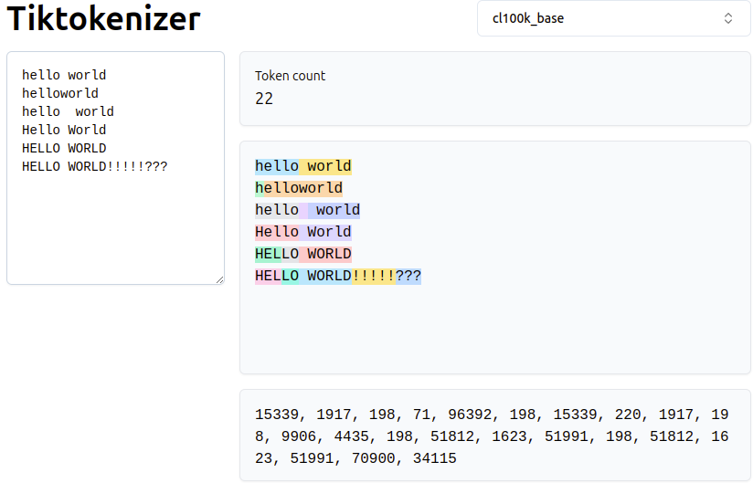
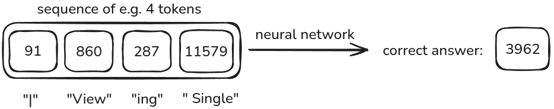
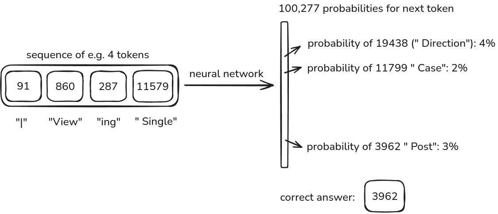
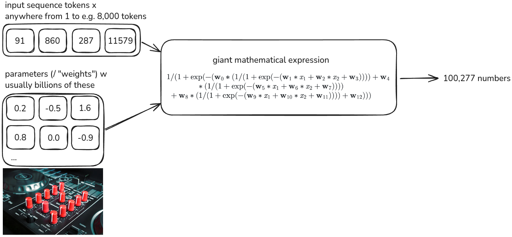
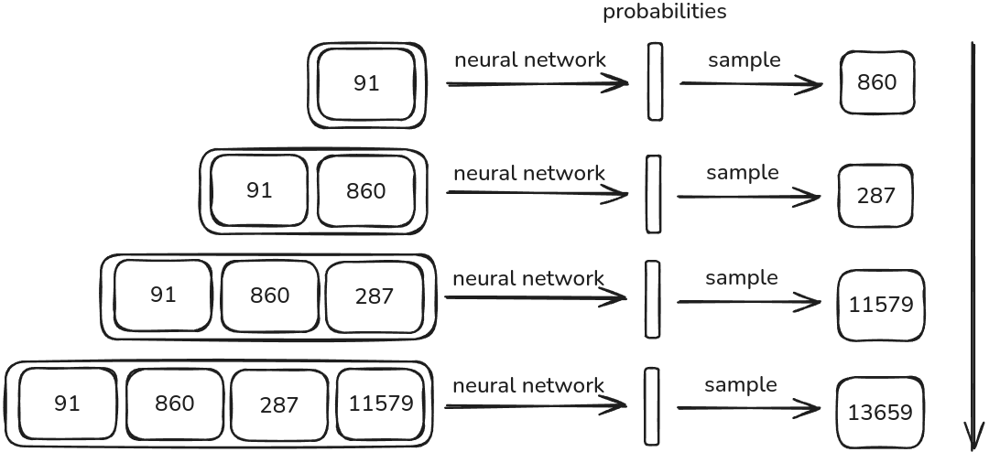
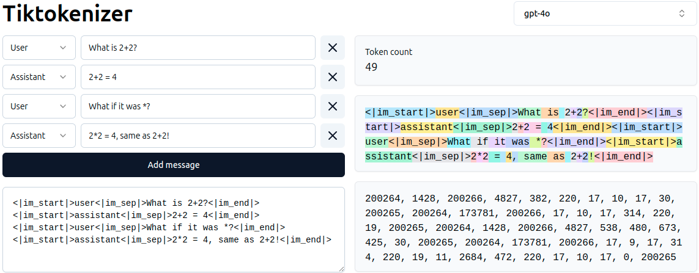
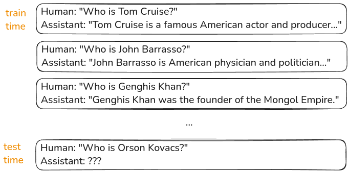
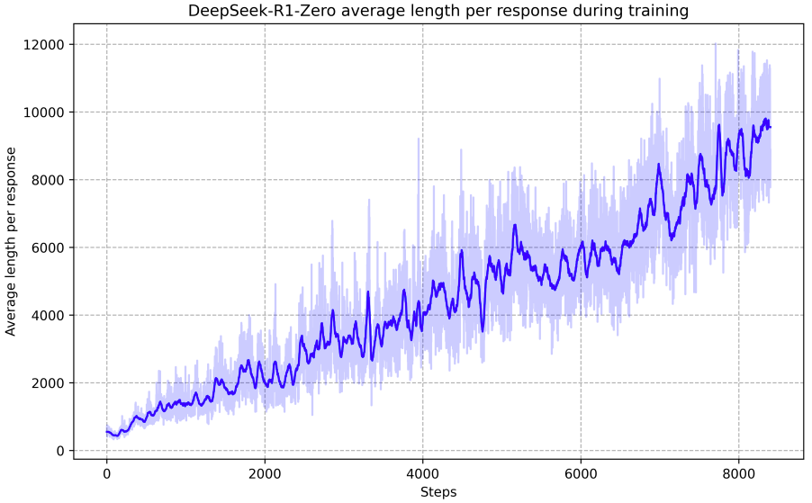

# A Deep Dive into LLMs

[Video](https://www.youtube.com/watch?v=7xTGNNLPyMI)<br>[Andrej's ExcaliDraw File](https://drive.google.com/file/d/1EZh5hNDzxMMy05uLhVryk061QYQGTxiN/view)<br>[Eureka Labs Discord](https://discord.com/invite/3zy8kqD9Cp)<br>Notes by [mk2112](https://github.com/mk2112)

---

**Table of Contents:**
- [Pretraining](#pretraining)
	- [Step 1: Download and Preprocess the Internet](#step-1-download-and-preprocess-the-internet)
	- [Step 2: Tokenization](#step-2-tokenization)
		- [Byte-Level Tokenization](#byte-level-tokenization)
		- [Byte-Pair Encoding](#byte-pair-encoding)
	- [Step 3: Training the Neural Network behind the LLM](#step-3-training-the-neural-network-behind-the-llm)
		- [Neural Network Internals](#neural-network-internals)
	- [Step 4: Inference](#step-4-inference)
	- [Recap: The LLM Pretraining Pipeline](#recap-the-llm-pretraining-pipeline)
	- [GPT-2: Training and Inference](#gpt-2-training-and-inference)
	- [Base Models and Llamas in the wild](#base-models-and-llamas-in-the-wild)
	- [Recap: Hallucinating LLamas](#recap-hallucinating-llamas)
- [Post-Training](#post-training)
	- [Supervised Finetuning](#supervised-finetuning)
		- [Hallucinations](#hallucinations)
			- [Mitigation #1: Out of Scope Examples](#mitigation-1-out-of-scope-examples)
			- [Mitigation #2: Self-Induced Search](#mitigation-2-self-induced-search)
		- [LLMs Need Tokens to Think](#llms-need-tokens-to-think)
		- [Counting and Spelling with LLMs](#counting-and-spelling-with-llms)
	- [Reinforcement Learning](#reinforcement-learning)
		- [DeepSeek-R1](#deepseek-r1)
		- [Reinforcement Learning with Human Feedback](#reinforcement-learning-with-human-feedback)
- [The Future of LLMs is Bright](#the-future-of-llms-is-bright)
- [How to Keep Up?](#how-to-keep-up)

---

**What *exactly* are Large Language Models (LLMs) and tools like ChatGPT about?<br>How do they provide value?<br>What goes on behind that text box that you type your prompts into?**

---

LLMs are advanced AI systems trained to process and, based on that, generate human-like text by identifying linguistic patterns. Let's go though the topic of LLMs, back to back, from prompt to output, in an understandable fashion.

When providing a prompt to an LLM, and reading its output, it quickly becomes clear that there is some notion of experience embedded into the response you receive. The LLM may show with its response that it can process and articulate:

- Syntax (structure), 
- Semantics (meaning) and 
- Pragmatics (context and use of language).

When a user submits a prompt, the LLM's output reflects its ability to generalize from what is called **pretraining**.

> [!NOTE]
> **Pretraining** is the process of exposing an LLM to a vast amount of text. This way, the LLM is enabled to learn the statistical patterns from said text.

**Pretraining** constitutes a core objective—not a mere preliminary step—in LLM development. Achieving this requires us to walk a systematic sequence of steps. The steps outlined in the following will get us there.

---

## Pretraining

### Step 1: Download and Preprocess the Internet

**If we want to expose an LLM to a vast amount of text, we first need this vast amount of text to expose it to.**

Nowadays, data on the scale of *the entire internet* is used as basis for pretraining LLMs. To stick with this idea, *FineWeb*, a curated, filtered copy of textual contents of the internet was made available by and via HuggingFace:

- The *FineWeb* dataset: https://huggingface.co/datasets/HuggingFaceFW/fineweb
- The accompanying blog post: https://huggingface.co/spaces/HuggingFaceFW/blogpost-fineweb-v1

><b>:question: Wait. Why do we need this much text in the first place?</b>
>
>The sheer volume of high quality text is an essential contributor for training LLMs that are knowledgeable, versatile, and capable of understanding and generating text for a wide range of contexts. Just based on source and size, we can assume that <i>FineWeb</i> contains a multitude of facetted, diverse and informative texts. Exposing an LLM to this will help it learn a broad range of language.

><b>:question: So more is just better?</b>
>
>Not always. If we have a dataset that contains poorly worded or just bad text overall, an LLM pretrained on that will be poorly skilled. <b>An ideal dataset finds a balance between size, quality, diversity and cost for attaining it.</b> Public, curated datasets like <i>FineWeb</i> are a great help with all four of those aspects.

HuggingFace did a lot of work ensuring *FineWeb* is a large and high-quality dataset. Truth be told, HuggingFace didn't actually crawl for the text data themselves in the first place. Instead, they use a copy of [CommonCrawl](https://commoncrawl.org/latest-crawl) as basis. Since 2007, the organization behind *CommonCrawl* iterates over the internet and takes snapshots of the webpages. This is raw, untreated data. How did HuggingFace now ensure that the text data selected for *FineWeb* from *CommonCrawl* would be of high quality?

HuggingFace performed a series of what is called **data preprocessing** steps. These steps are crucial to ensure that the dataset is clean, consistent, and free of noise. More specifically, they went and applied a list of steps to remove low-quality texts from the *CommonCrawl* dataset to create *FineWeb*.

**HuggingFace applies these data preprocessing steps to CommonCrawl to retrieve and assemble *FineWeb*:**

<center>
</center><br>Image: https://huggingface.co/spaces/HuggingFaceFW/blogpost-fineweb-v1

1. **URL Filtering**:  
	URL Filtering removes sources that are deemed low-quality or irrelevant ahead of the text gathering process itself. Sources such as spam, adult content, or non-informative pages are discarded, ensuring that only reputable and potentially useful content is considered further. HuggingFace uses specifically [this blocklist](https://dsi.ut-capitole.fr/blacklists/).
2. **Text Extraction**:  
    With the URL filtering done, the raw, crawled webpage content (containing text but also e.g. the underlying HTML code used to display the webpage as such, links, etc.) is processed to discard unnecessary parts and extract clean, readable text. This involves a rule-based removal of HTML tags, scripts, and other non-textual elements, while preserving the main content itself.
3. **Language Filtering**:  
    The extracted text is now subjected to language filtering to ensure the corpus is linguistically consistent. Non-target languages are filtered out, retaining only text in the desired language(s). For *FineWeb*, HuggingFace applies the [FastText Language Classifier](https://fasttext.cc/docs/en/language-identification.html) to retain only english text. This classifier provides not only a decision on language, but also its degree of certainty in this choice. If the confidence scoring is $\geq 0.65$ for English, they keep the text.
4. **Gopher Filtering**:  
    Gopher filtering, first performed for Google [DeepMind's Gopher](https://deepsense.ai/wp-content/uploads/2023/03/2112.11446.pdf) model, is applied to remove low-quality or boilerplate text. This step uses pre-defined rules or even machine learning models to identify and eliminate repetitive, non-informative, or template-like content (e.g., navigation menus, disclaimers, product lists), ensuring the remaining dataset contains meaningful and diverse text.
5. **MinHash Deduplication**:  
    To avoid content redundancies, this technique identifies near-duplicate documents by comparing hashing the examples and comparing those hashed representations, removing examples with another identical or near-identical hash already present. This aims at ensuring content diversity while avoiding overrepresentation of identical, highly similar, or just often encountered texts.
6. **C4 Filters**:  
    FineWeb incorporates filters inspired by the [C4 dataset](https://huggingface.co/datasets/allenai/c4), which include removing lines with e.g. excessive punctuation or non-natural language text.
7. **Custom Filters**:  
    Custom filters are applied to address specific requirements or biases potentially encountered in the dataset at this stage. These may include domain-specific exclusions, removal of offensive content, or other tailored criteria.
8. **PII Removal**:  
    Wrapping up the data preprocessing of FineWeb, personally identifiable information (PII) is removed to ensure privacy and compliance with data protection regulations. This involves detecting and redacting sensitive information, like names, addresses, phone numbers, and email addresses.

><b>:question: Wait. What will it mean for our LLM to pretrain on a dataset of English text only?</b>
>
>The LLM will be good at processing and responding to English text. It will be able to understand and generate English text well. But it will not be able to do the same for any other languages.<br> But, note that while <i>FineWeb</i> is derived from English text sources, a new and language-wise broader <a target="_blank" href="https://huggingface.co/datasets/HuggingFaceFW/fineweb-2">FineWeb 2</a> is in the making, allowing training models that will then be able to pretrain to be good at multiple languages in the future.

After passing the raw CommonCrawl data through the preprocessing pipeline, HuggingFace attained *FineWeb*. But what does this dataset actually look like now? 

Luckily HuggingFace just shows us with its [Dataset Preview](https://huggingface.co/datasets/HuggingFaceFW/fineweb) feature:

<center>

</center>

**What are we seeing here?**<br>This is an excerpt of a table. Fundamentally, each row of this table is an entry in the *FineWeb* dataset. Each row for example contains an entry in the `text` column. This is the text that *CommonCrawl* had retrieved from some corner of the internet and that underwent HuggingFace's thorough *data preprocessing*.

But there's more than just the `text` column.<br>The *FineWeb* dataset contains the following columns for each crawled website:

1. `text`: The actual text content extracted from a web page.
2. `id`: A unique identifier for each entry in the dataset.
3. `dump`: Indicates the specific Common Crawl snapshot from which this text was extracted.
4. `url`: The web address of the original source web page.
5. `date`: The timestamp of when the web page was captured.
6. `file_path`: The location of the file within the dataset storage system.
7. `language`: The detected language of the text content.
8. `language_score`: A confidence score for the language detection, ranging from $0.65$ to $1.00$.
9. `token_count`: The number of tokens in the text content. We will talk about this later.

The purpose of the additional columns is to provide metadata and context for each entry in the dataset. This way, HuggingFace provides the *FineWeb* dataset is not just as a collection of text snippets, but as a further structured and organized resource.

**Ok. High-quality text data secured. What's next?**

---

### Step 2: Tokenization

The claim raised by *Step 1* was that if we go and expose an LLM to the gigantic corpus of text that is *FineWeb*, the LLM may become able to internalize and model the textual patterns, statistical nuances of which phrases follow which and a fundamental, general, conceptual understanding of how language expresses coherent information. **That would be nice, wouldn't it?** But "exposing the LLM to the data" is not that easy. 

An LLM expects input to be a one-dimensional sequence of a limited set of symbols. You can argue that text "as-is" is already such a one-dimensional sequence. But we can't really calculate with letters, we need some sort of numeric representation of them.

> [!NOTE]
>We have to find a numeric representation that is ideally as unique, as expressive and as short as possible for a given text. Transferring a text to this representation is called **Tokenization**. The shorter a good numeric representation of a text can be, the longer the text sequences can be that we process with the LLM in the end, i.e. the more input we can provide or the more of past prompts and responses the LLM will be able to remember.

For example, like everything else shown and processed by a computer, at its lowest abstraction, text is just binary code. We could translate a text into its binary representation and that would be a one-dimensional, numeric, unique representation. But it would be awfully extensive and inefficient, because we would need a lot of bits to represent a single character. This would limit the amount of text we could process at once with the same amount of resources. This in turn would limit the amount of text we could refer to for generation. We would reduce the LLM's ability to remember and refer to past prompts and responses. Our LLM would suffer with binary as our level of abstraction to apply.

#### Byte-Level Tokenization

We've seen that bit-level binary is not a good choice for tokenization. But what about moving up the abstraction hierarchy? What about not using only zeros and ones to embed a text, but to use groups of zeros and ones to represent fragements of the text?

A byte is a sequence of $8$ bits, meaning $8$ values, each either $0$ or $1$. One byte can be one of $2^8 = 256$ different combinations of zeros and ones.

><b>:question: How is this different from bit-level tokenization?</b>
>
>The difference becomes clear when we consider that a byte can represent $256$ different values. In other words, our tokenization vocabulary now contains the values $0$ to $255$, instead of just $0$ and $1$. These values are also more distinctly calculable than bit-level values. By having a tokenizer map text to a numerical representation of bytes, the tokenization itself became more expressive and efficient. We can now represent and distinguish more characters, numbers, and symbols with a respective byte.

><b>:question: I still don't get it. Aren't bytes just concatenations of bits?</b>
>
>Yes, bytes are concatenated bits. But the critical distinction lies in how their different levels of abstraction are used. Don't think of Bits and Bytes as numbers, but as IDs with a scope for what they can uniquely identify.<br><br><b>Bits</b> represent atomic 0/1 values, allowing for capturing only minimal semantic meaning e.g. "01100010" consists of 8 individual tokens<br><b>Bytes</b> treat entire 8-bit groups as single tokens, "01100010" becomes 1 token: 98. The byte-level tokenizer has to produce that one value instead of the 8 individual bit values.<br><br><b>Think of it like this:</b> The grouping into byte-level tokenization mirrors how humans, instead of deciphering individual pen strokes, read the word that is formed by these strokes.

The key insight is that the byte-level tokenization produces values per byte of text. $1$ byte token = $8$ bits, so it produces $8\times$ shorter sequences than bit-level tokenization.

#### Byte-Pair Encoding

Depending on the dataset, the model and the needs for tokenization efficiency, byte-level tokenization might still be too extensive, i.e. each tokens covers too little information. As we discussed earlier for the binary tokenization, having a token represent too little information has the effect of reducing the model's ability to remember and refer to past prompts and responses by bloating the token sequence with too many tokens, because of, as we said, each token representing too little information.

**We can go up the abstraction hierarchy once more:** Instead of treating each byte as a token, we can treat each pair of bytes as a new token of (the previously unused) value $256$ and so on. This is called **Byte-Pair Encoding (BPE)**.

> [!NOTE]
> Iteratively, **BPE finds the most frequent pair of consecutive bytes in the byte-level encoded text and then replaces this most frequent pair of bytes with a new, single, distinct byte.** This way, what required two tokens to express now uses up only a single one. The tokenization vocabulary is reduced, and the token sequences become shorter.

As BPE can be repeated iteratively, it can find the next most frequent pair of tokens time and time again and replace it with a new token. We can do that for as long as we wish, in fact. This way, the tokenization vocabulary expands, but this allows for the token sequences of the tokenized text to in turn become shorter and shorter. And that is what we want to enable the LLM to remember and refer to more past prompts and responses.

> [!NOTE]
>As a rule of thumb, one should aim to use BPE to produce around $100000$ distinct tokens for tokenization based on a large dataset like *FineWeb*. For example, GPT-4 uses a vocabulary of $100277$ distinct tokens through the `cl100k_base` tokenizer.

To tie it back to the actual text we want to tokenize: The [blog post on *FineWeb*](https://huggingface.co/spaces/HuggingFaceFW/blogpost-fineweb-v1) stated an estimate for the entire dataset to take up $15$ trillion tokens. This of course depends on how we tokenize and how far we BPE'd our approach. But to achieve this, generally, the text is first encoded into bytes, then the byte-level tokenization is applied, and finally the BPE is applied to the byte-level tokens. The result is a sequence of tokens that is shorter than the original text, but still retains the information of the text.

We can see BPE in action when looking at GPT-4's `cl100k_base` tokenizer. The same phrase, "Hello World", written differently, is also tokenized differently, but more importantly, distinctly. Try it out for yourself with [dqbd's TikTokenizer App](https://tiktokenizer.vercel.app/):

<center>

</center>

So, in total, models like GPT-4 see from the arbitrary text they might get prompted with is series of numbers like this here, shown in the lower right corner:

<center>

</center>

You can learn even more about tokenization in [chapter 8](../008%20-%20GPT%20Tokenizer/008%20-%20Tokenization.ipynb) of this series.

---

### Step 3: Training the Neural Network behind the LLM

**LLMs are a specific type of model based on neural networks**, trained for a specific purpose, i.e. to process and generate human-like text. To understand general neural network training means to understand how LLMs are trained.

> [!NOTE]
>With neural network training, we hinted until now at wanting to "expose" our model to the pretraining data from *FineWeb*. More specifically now, **we want to model the statistical relationships between tokens, the likelihoods for which tokens follow which in our pretraining dataset.**

Given our pretraining dataset, we take some random window of sequential tokens. This window's size can be anything from zero to an upper bound that we can set ourselves. Practically applied token windows are usually around $8000$ tokens long. The token windows are also more commonly referred to as **context windows**.

> [!NOTE]
> The longer a context window, the more context the LLM can consider, but the more computationally expensive this consideration becomes, as it spans more tokens.

><b>:question: Isn't this really bad that we have to do this, capping the context window size like that?</b>
>
>It's more nuanced than that. Yes, effectively this caps the bandwidth of information the LLM can process at once/in concurrent consideration. But with this architecture of LLMs that we're in fact about to discuss, unlimited context would require infinite memory. And actually, in practice, often the most meaningful patterns are witnessed to occur within practical window lengths. But strictly speaking, one could argue that this is a limitation of current LLMs.

Given a context window that we feed into our LLM, our objective is to get the LLM to predict the single next token that follows the window's tokens as per the pretraining dataset. This is called **autoregressive training:**

<center>

</center>

To reiterate, **the input is a sequence of tokens, variable in length up to the maximum we set as the context window size.** Then, **the output is a single token, which is expected to be the one that follows the input sequence in our pretraining dataset.** The LLM is trained to predict this next token.

But it isn't quite as straight forward as the image would have us believe. LLMs actually do not produce a single token as output. Instead, **LLMs actually produce a probability distribution over all possible tokens in the vocabulary.** 

This is because the LLM is not trained to predict the next token with certainty, but to predict the next token with a certain probability. **The LLM is trained to predict not tokens as such, but the likelihood of tokens to occur next.** This is what we mean when we say that the LLM models the statistical relationships between tokens.

For example, we said that GPT-4 uses a vocabulary of $100,277$ distinct tokens. GPT-4 would then output a probability distribution over these $100,277$ tokens, assigning a percentage likelihood to each token according to the LLMs view on how likely that token is to occur next in the pretraining dataset. So, what actually happens is this:

<center>

</center>

We can see that the LLM does not yet produce the correct token certainty. We know the next token to be `3962` from our tokenized dataset. But, the LLM assigned a higher probability to the token `19438` ('Direction') than to the correct token `3962` ('Post').

This is where pretraining comes into play. **Pretraining an LLM means shifting the LLM's parameters for it to produce probability distributions that better capture what actually follows as next token in the dataset.** In our case, the result of pretraining would assign higher probabilities to the actual follow-up token, which could look like so:

<center>

</center>

This is an ideal state, the LLM correctly assigned the highest probability for the next token `3962` that also occurs next in the dataset:

<center>

</center>

> [!NOTE]
> **Pretraining is a mathematically rigid process to compare the LLM's output probability distribution to the actual next token in the pretraining dataset.** The difference between the LLM's output and the actual next token is calculated as a loss value. The LLM is then traversed, nudging its parameters in a way that minimizes this loss value in a next iteration, i.e. to get better at predicting the next token. **This happens over and over again, iteratively, for each context window retrievable from the pretraining dataset.**

><b>:question: Why would we afford to produce so much output for every single token, requiring a lot of resources to do so?</b>
>
>Producing a probability distribution over all tokens for each prediction is indeed computationally intensive, mainly due to the large vocabulary size (e.g., 100k+ tokens) across which we operate for each token. However, producing a probability distribution over all tokens is essential because it allows the model to capture the statistical relationships between different tokens more explicitly, more accurately. By predicting likelihoods for every possible token, the model is enabled to learn more nuanced patterns in the data, enabling it to generate coherent and contextually appropriate text. This is foundational for autoregressive training.<b>While computationally costly, this method enables LLMs to achieve high performance and flexibility.</b> Because of this, it is considered a justified trade-off for the quality of results.

#### Neural Network Internals

So far, we've looked at the outer conditions for training an LLM. But what goes on inside the neural network that is the LLM? How does it in fact learn to predict the token probabilities?

**At this point, we can already say that:**
- We have **inputs** $x \in X$, with each $x$ being a token sequence of up to $\text{context size}$ length.
- We expect $\text{vocab size} = 100277$ **distinct probabilities** as output, one for each token in the vocabulary.
- We have **expected outputs** $y \in Y$, with each $y$ being a distinct choice of token as next token to the input sequence.
- A neural network is a giant mathematical function $f: X \rightarrow Y$ that maps inputs to outputs, consisting itself of millions, billions or trillions of **parameters**, also called **weights**.

<center>

</center>

Remember that different $x$ may be of different lengths. For our model, we accept input lengths from $0$ to $\text{context size}=8000$ tokens as an example.

Assume a very initial setting where our LLM hasn't ever seen any text yet. The LLM's parameters are initialized randomly. The LLM is then iteratively fed context windows from $X$. For each context window $x$, the LLM produces a probability distribution over all tokens in the vocabulary. This is the LLM's output $\hat{y} = f(x)$. 

We can now compare $\hat{y}$ against the true $y$ from the dataset. The difference between $\hat{y}$ and $y$ is calculated as a loss value. Based on this loss, the LLM's parameters are adjusted in a way that the outputs $\hat{y}$ become more consistent with the patterns $y$ we see in the dataset. The model parameters are updated for the loss to shrink. This is called **backpropagation**.

> [!NOTE]
> Training a neural network, like an LLM, means to discover a setting of the network's parameters that seems to be consistent with the statistics of the training data in term of the output probabilities.

To do that, i.e. to have the neural network learn, it has to produce that probability distribution we talked about in the first place. Somehow, this has to involve the training-adaptable weights.

In the image above, you see the model itself expressed as a 'giant' mathematical expression:
<center>

</center>

Truth be told, this is a long expression, but it's not too complicated to look at. For example, we can see that the individual tokens $x_n$ of the input are multiplied with respective weights $w_n$. These products are then the basis for further interconnecting calculations, resulting in the model's output $\hat{y}$, i.e. the $100277$ probabilities.

To see the actual, fully layed out structure of such a 'giant mathematical expression' for several different types of LLMs, refer to https://bbycroft.net/llm. 

Here's an example of the structure of [NanoGPT](https://github.com/karpathy/nanogpt):
<center>

</center>

You can see that even this tiny model consists of a considerable amount of intermediate steps and parameters. Interestingly, we can see that a very particular type of neural network finds application in LLMs like NanoGPT: **Transformer Networks**.

**Very generally speaking:**
- First, we embed the tokens. Each token is mapped to a higher-dimensional vector space, where the model itself can learn how to express distinguishing features of the tokens with these vectors.
- The green arrow originating from the 'Embedding' layer in the image above is traces the flow of the token embeddings through the model.
- The first branch-off leads to the 3-Headed **Attention Layer**, and so on. We will go into detail on this in due time.
- The whole structure is logically traversed from top to bottom, with the model's output being the probability distribution over the tokens.

Note that although we use the terms "neural" and "neuron", there's no biochemistry anywhere. The "neurons" are just mathematical functions that are applied to the input data, or in our case, the token embeddings and further intermediate results.

> [!NOTE]
> LLMs are big mathematical functions, parameterized by a fixed, large set of parameters, which may be initially set at random. It receives token sequences as input, and produces, through having information flow through different layers, notably the *Transformer Blocks*, a probability distribution over all tokens in the vocabulary. The model is trained to adjust its parameters to minimize the difference between its output and the actual next token in the pretraining dataset.

If you want to go deeper into the precise mathematical structure of LLMs, you can refer to the [GPT From Scratch](../007%20-%20GPT%20From%20Scratch/007%20-%20GPT.ipynb) chapter of this series.

---

### Step 4: Inference

So far we looked at how to get text into an LLM and (on a high level) how to have learn from that text. But we were very clear about the LLM only producing probabilities over tokens, producing one most favored token at a time. **How do we get the LLM to actually generate text?**

To generate text, just repeatedly predict one token at a time, appending that to the input for generating the next token. This is called **autoregressive generation**.

Assume we have a trained LLM that we want to get some output text from. Say we start with the token $91$. The LLM will produce, based on this input, a probability distribution over all tokens and we can sample from this distribution to get the next token. **The higher the probability assigned to a token by the model, the more likely that token is to be sampled.** 

><b>:question: Why dont we just pick specifically and only the token deemed most likely by the LLM?</b>
>
>The decision to use sampling approaches (like temperature-based sampling) instead of always selecting the single most likely token (which would be called a "greedy" strategy) is rooted in the <b>added possibility of balancing accuracy, diversity, and creativity in the LLM outputs.</b><br> You may want to avoid single 'best guesses' and with that, avoid repetitive and uncreative responses, especially in tasks like dialogue generation or text completion. Also, <b>there might be multiple valid continuations of a prompt. Sampling allows the LLM to not have to disregard these options.</b>

Say that for input $91$ the sampled token is $860$. Now what?

We append token $860$ to token $91$. This sequence will be the input to the LLM for the next round, producing the third token, $287$ in this case, and so on. **Effectively, the LLM regards its own output as the next input, building a chain of tokens, one after the other, to generate text and respond coherently.**

<center>

</center>

Compare the last generated token $13659$ to what we previously said was the correct answer as per the pretraining dataset: $3962$. The LLM's output is not `|Viewing Single Post`, but `|Viewing Single Article` now. This is a good example of the LLM's creativity and flexibility in generating text. We don't want it to blabber out the exact dataset contents, but we want it to rather show the understanding that an `Article` and a `Post` may share the property of being `Viewed`. This is what's called **generalization**.

> [!NOTE]
> **Generalization** is the ability of an LLM to not just memorize the training data, but to understand the underlying patterns and concepts in the data, and to apply these to new, unseen data. Stochasticity, e.g. by sampling from the output token probabilities, is elemental to this, as it allows the LLM to generate diverse, creative, and contextually appropriate text.

---

### Recap: The LLM Pretraining Pipeline

We went through a high-level but comprehensive walkthrough of the steps involved in training and using an LLM. We saw how data is retrieved and tokenized for the LLM to get exposed to it, how it learns from this data, and how it generates text based on this data. We also looked briefly at the general neural network structure behind the LLM and how the LLM generates text using autoregressive generation.

---

### GPT-2: Training and Inference

GPT-2 is an LLM that was released by OpenAI in 2019. Along with this release, the accompanying paper [Language Models are Unsupervised Multitask Learners \[Radford, et al. 2019\]](https://cdn.openai.com/better-language-models/language_models_are_unsupervised_multitask_learners.pdf) was published.

> [!NOTE]
> **GPT stands for General Pretrained Transformer**.<br> GPT-2 is indeed not a single model, but a series of models with different sizes:
> - GPT-2 Small: $124\text{M}$
> - GPT-2 Medium: $355\text{M}$
> - GPT-2 Large: $774\text{M}$
> - GPT-2 Extra Large: $1.5\text{B}$
>
> All GPT-2s have a maximum context length of $1024$ tokens and were trained on $\sim 100\text{B}$ tokens. At the time of writing this, the most recent iteration of this type of LLM is GPT-4.<br> All of the elements of GPT-2 became known, recognized and applied in Natural Language Processing (NLP) over time, just in a scaled-up fashion. **GPT-2 set the standard for modern LLM architectures, and it was a big deal.**

Nowadays, models are still largely based on the structures and conceptual ideas that GPT-2 introduced. The models mainly differ in size, training data, and training duration. For example, GPT-2 Extra Large, at $1.5\text{B}$ parameters, is small by today's standards, with current models nearing $1\text{T}$ parameters. The same scaling was applied to the training data and the context window size.

We extensively discuss and walk through implementing GPT-2 in [chapter 9](../009%20-%20Reproducing%20GPT-2/009%20-%20Reproducing_GPT-2.ipynb). You may also refer to [Andrej's llm.c GitHub Repository](https://github.com/karpathy/llm.c/discussions/677) for a C-based implementation of GPT-2.

The reason we were able to scale from GPT-2 onwards to today's models is manifold. The most important reasons are:

- Data availability and quality increased substantially, e.g. through platforms like HuggingFace, allowing for more extensive pretraining.
- Computational resources became more available and more powerful both hardware- and software-wise, allowing for larger models to be trained. Refer to the [stock price of NVIDIA](https://www.perplexity.ai/finance/NVDA) for reference on this and the effect that better GPUs have on the field of AI.

><b>:question: Why are GPUs used for AI training?</b>
>
>While neural network training, especially at today's scales, is considered expensive, the computations we actually perform are well parallelizable. In other words, a lot of the calculations happening within tokenization and training can be rewritten into matrix operations. GPUs happen to be really good at that.<br><br>GPUs are designed to handle many parallel calculations at once, originally for rendering graphics. This makes them ideal for training neural networks, which are essentially just a lot of matrix operations. Getting really good GPUs to train neural networks and to do so well makes up <b>the gold rush</b> of the 2020s.

We won't go into full detail on the implementation. Again, please refer to [chapter 9](../009%20-%20Reproducing%20GPT-2/009%20-%20Reproducing_GPT-2.ipynb) for that. **But, intuitively, what does it look like to actually train one of these models as a researcher?**

Andrej at this point showed an active training run:
<center>

</center>

This is the free code editor [VS Code](https://code.visualstudio.com/).<br>I added four red arrows to the image to highlight the following:

Using VS Code, Andrej connected to a remote machine with GPUs via a protocol called SSH. Absolutely not relevant to us, don't worry about it, we only need this to understand that VS Code allows to show what is currently going on a different, remote, more powerful machine.

On this powerful machine, a GPT-2 training run is conducted. The training run is shown in the terminal window that we see here. First, we see some text. During training, from time to time, Andrej switches the model between getting trained and generating text. This way, one can follow on how the model improves. The second red arrow points to such a demo text generation run.

The third red arrow points to the training steps themselves. After we looked at how the model generated text, more training is applied. Each step consists of one million context windows being retrieved from the dataset, getting tokenized, and then fed into the model one after another. For each context window, the model then produces a probability distribution over the tokens, and the loss, i.e. the difference between sampled $\hat{y}$ and expected $y$ is calculated. The loss then, and this is new, is averaged across the one million examples. Only based on that, for this one step, the model is updated. This is then repeated, for a total of $32000$ times (so a total of $32\text{K}*1\text{M}=32\text{B}$ context-based next token predictions), with interludes of text generation to check on progress.

><b>:question: Are these interludes with the inferences really necessary?</b>
>
>There's no strict answer to this and one could certainly argue about that. It's a good practice to check in on the model's progress in capability though, especially when training such large models. It's a way to ensure that the model is learning the right things, the researcher might get a feel on how the model starts to grasp correlations from the text, concepts from those correlations etc. This also helps identify issues early on and therefore cheaply. <b>It's a good practice to ensure that the model is learning the right things, and to catch any potential issues early on. Showing inference results every few steps helps significantly in achieveing this.</b><br><br>For example, look at the very first inference run:
>
Compare that to the result after 400 steps:
>
While still nowhere near perfect, we as the researcher get a feeling that training so far is going in the right direction. So far, so good.

Ok, so this is what we can expect training to look like. But I mentioned that this wasn't done on an arbitrary machine, but instead a machine we remotely connected to. **Why is that?**

The remote machine may be a dedicated system for neural network training, housing potentially multiple GPUs to train more models more quickly. Those systems can cost several millions, even billions of dollars. The remote connection allows us to use the power of these systems without having to own them ourselves. This is called **cloud computing**. You can rent these systems for a certain amount of time or capacity, and only pay for what you actually use.

Cloud computing providers for neural network training include:
- [Lambda Labs](https://lambdalabs.com/)
- [Hyperbolic](https://www.hyperbolic.xyz/)
- [Paperspace](https://www.paperspace.com/)
- [CoreWeave](https://www.coreweave.com/)
- [Google Colab Pro](https://colab.research.google.com/)
- [Google Cloud Platform](https://cloud.google.com/)
- [Microsoft Azure](https://azure.microsoft.com/)

---

### Base Models and Llamas in the wild

We can't expect everybody to pull out their credit cards and afford training runs for new models on state-of-the-art infrastructure like that. 
Fortunately, we can download what are called **base models** and run inference on them on our local machines with much less resource demands.

There are a couple of companies who offer pretrained models for download, like:
- [HuggingFace](https://huggingface.co/)
- [EleutherAI](https://eleuther.ai/)
- [DeepSeek](https://deepseek.ai/)
- [Falcon Foundation](https://falconfoundation.ai/)
- [FAIR](https://ai.facebook.com/)

These models most often can be found on the [HuggingFace Model Hub](https://huggingface.co/models).

**A base model release consists of two parts, at minimum:**
- An implemented architecture of the model, i.e. the structure of the neural network, the layers and their interconnections, and
- The model's parameters, i.e. the weights that the model has learned during pretraining.

**Just for comparison on how far the scaling has come for base models:**
- OpenAI GPT-2 XL (2019): $1.5\text{B}$ parameters, trained on $100\text{B}$ tokens
- FAIR Llama 3.1 (2024): $405\text{B}$ parameters, trained on $15\text{T}$ tokens

Base models have been exposed to the pretraining step we discussed early on. This is arguably the most expensive step for producing an LLM, but it is not the only step. Think of it like this: Now that we exposed a model to the pretraining data, the model may have learnt concepts and insights from correlations in the token sequences.

**What do we get from those Base models?**<br>We can find out what base models like Llama 3.1 405B behave like when accessing them through e.g. [Hyperbolic](https://app.hyperbolic.xyz/models/llama31-405b-base).<br>This costs money though.

Here's what it looks like when asking the Llama 3.1 405B base model to solve a simple math problem:<br>
<center>

</center>

Trying once more results in:<br>
<center>

</center>

And once more:<br>
<center>

</center>

We very clearly see the stochasticity in the next token selection at work here. The responses vary, but the model shows conceptual understanding of what we presented to it either way.

> [!NOTE]
>**Intuitively, the pretrained base model has no idea what to do with the information it received during said pretraining yet.** It may show that it is indeed conceptually aware of the input, but it will show that its knowledge may indeed be vague and it will trail off into blabbering akin to a child that has no idea what to do with the information it received.

**Think of ChatGPT for example:** At its release, ChatGPT was powered by the GPT-3.5 model. But when prompted, the model wouldn't just continue to write based on our text, but it would answer questions, generate code, or even write poetry on our demand. **The GPT-3.5 model was fine-tuned to this specific task of being an assistant to the prompting person.** Those models are referred to commonly as **Instruct models.**

Let's actually stay with the base model Llama 3.1 405B for a moment.<br>How does a pretrained model react to data it knows vs. data it has never seen before?

Let's say we prompt Llama 3.1 405B Base with the opening sentence to the Wikipedia article on [zebras](https://en.wikipedia.org/wiki/Zebra):

<center>

</center>

The model continues the text with a coherent, contextually appropriate response. But, moreover, **it reproduces a near-exact copy of the Wikipedia article on zebras.** This is because the model has seen this text before during pretraining. Moreover, the texts from Wikipedia are generally considered high-quality, so they are used multiple times in pretraining datasets. This causes a seeming close familiarity of the model with the text.

According to [The Llama 3 Herd of Models \[Grattafiori, et al. 2024\]](https://arxiv.org/pdf/2407.21783#page=4.70), the data used for pretrained as gathered until the end of 2023. So, what if we'd prompt it with a sentence on the 2024 US presidential elections and see how Llama 3.1 405B Base reacts:

<center>

</center>

This looks reasonable, but we know better. This is factually false, hallucinated by the model based on what sounds good together, as the model just didn't know any better from the older pretraining data.
This effect is also one of the reasons why one shouldn't use LLMs for fact-checking or knowledge retrieval (this regards LLMs with no connection to the internet. LLM's with such a research capability exist now, and can be used for search, like [Perplexity.ai](https://perplexity.ai)).

### Recap: Hallucinating LLamas

We've seen that while base models like Llama 3.1 405B show that they are conceptually aware of the input, their knowledge strictly relates to the pretraining data and its format. Moreover, **base LLMs aren't operating in any task-specific fashion.** We've seen that in the LLM hallucinating on content beyond its pretraining data's knowledge cut-off, and it trailing off into blabbering at times.

**We can do better than that.**<br>And indeed, there's a stage following the pretraining stage that will help us address these issues. This stage is called **Post-Training**.

><b>:question: Are there use-cases where one would explicitly not need any more than the pretraining step for their LLM? Under what conditions could we stop here?</b>
>
>There are use-cases where pretraining alone suffices, especially when the task at hand relates closely to general language patterns. For example, if the goal is to generate long form, structurally correct text without specific domain or style requirements, pretraining may be sufficient. But you will notice that this kind of task goes short on retrieving the embedded concepts and insights from the pretraining data.

---

## Post-Training

### Supervised Finetuning

> [!NOTE]
>**Post-Training** is the process of taking a pretrained model and additionally mending it to our task-specific needs. This could e.g. be developing answers not as continuations of text, but as responses to them.

Before, we thought of LLMs pretty much as 'sophisticated next token predictors'. But now we want to bring in the aspect of conversation, the back and forth between human and AI-assistant:

<center>

</center>

**How can we 'program' our pretrained LLM to behave like this?**<br>We can use a technique called **Supervised Finetuning.**

> [!NOTE]
> **Supervised Finetuning** is the process of taking a pretrained model and training it on a dataset that may contain only few, but very task-specific examples of how we would like the model to generate text. The model's parameters are adjusted to better predict the task-specific data, while still retaining the knowledge it gained during pretraining.

Training on such a dataset is done with relatively **low learning rate**. We don't want to replace the model's pretraining-gained knowledge, but rather shape it a bit to adjust the LLM's behavior with said knowledge to our task-specific needs. 

Training will be short and fast, but with *supervised finetuning* **the complexity is not the training itself, but the assembly of the task-specific finetuning dataset.**

**How can we represent conversational patterns in a dataset?**<br>The image above makes it look easy: Just lay out a two-sided chat-like conversation to the model. It's not that straightforward. For example, how could we best turn conversations between distinct parties into token sequences for the model? How exactly should such structures get encoded and decoded?

Akin to what the [TCP/IP stack](https://cdn.kastatic.org/ka-perseus-images/337190cba133e19ee9d8b5878453f915971a59cd.svg) is for networking, we can use a new, extra created tokens to build a **token protocol** for encoding conversational patterns for the model.

This concept is best explained by looking at how GPT-4o does this:

<center>

</center>

> [!NOTE]
>There are **new, special tokens** in the tokenization vocabulary, representing `<|im_start|>` (imaginary monologue start), `<|im_sep|>` and `<|im_end|>`. These tokens are used to **denote the beginning and end of a conversation turn**. The model is trained to recognize these tokens and generate responses accordingly.

We actually really create this token only after pretraining concluded. The LLM has never seen it before, but they get the model to learn to distinguish who's talking when and how to respond to that in context. And, importantly, **as this addition of tokens still creates a sequence of tokens, we can just apply the same training pipeline as for the pretraining step.**

So, a prompt given to a finetuned GPT-4o to respond to a user could for example look like this:

```
<|im_start|>assistant<|im_sep|>What is 2+2?<|im_end|>
<|im_start|>assistant<|im_sep|>2+2 = 4<|im_end|>
<|im_start|>user<|im_sep|>What if it was *?<|im_end|>
<|im_start|>assistant<|im_sep|>
```

This is just the textual input from the user and the past response from the LLM neatly wrapped into the special tokens. From here it is autoregressive generation as we know it already.

[Training language models to follow instruction with human feedback \[Ouyan, et al. 2022\]](https://arxiv.org/pdf/2203.02155) layed out for the first time how OpenAI would take an LLM and finetune it on conversations. This paper for example discusses "Human data collection", i.e. the process of gathering the task-specific finetuning dataset from human annotators who write out how conversations with the LLM should look like as part of the finetuning dataset:

<center>

</center>

The human labelers not only provide the generation instructions, but also the ideal LLM responses. This is done according to a set of **labeling instructions**, meaning a set of rules that the labelers must follow when creating the finetuning dataset.

<center>

</center>

However, it turns out that the paper's InstructGPT finetuning dataset was never publically released. Open source efforts went into replications of the finetuning efforts, e.g. through [OpenAssistant/oasst1](https://huggingface.co/datasets/OpenAssistant/oasst1) or [OLMo-2-Mixture](https://huggingface.co/datasets/allenai/tulu-3-sft-olmo-2-mixture).<br>A more modern conversation dataset would be [UltraChat](https://github.com/thunlp/UltraChat). This finetuning dataset is relatively large, covering multiple and vast areas of knowledge but also in part **synthetic, meaning that it was generated by an LLM, for an LLM.**

> [!NOTE]
>You can think of an LLM that underwent supervised finetuning as a **task-specific LLM**. If the task is to be a conversation partner, we can call it a **Conversational LLM**. The LLMs task to finetune on will be to mimic the human labeler-provided chat interactions as closely as possible. 

We can say that with supervised finetuning, **talking to a Conversational LLM like ChatGPT is the statistical mimicing of talking to a human annotator.**

#### Hallucinations

We briefly discussed them earlier on in the context of the pretrained base LLMs, but **hallucinations aren't cured by supervised finetuning**. The chatbot LLM may still fabricate good-looking but factually incorrect responses. This is because the LLM is still bound to the pretraining data's and the finetuning data's knowledge cut-off:

<center>

</center>

Interestingly, although the LLM might in some sense be aware that "Orson Kovacs" is a person that it knows nothing about, it still tries to make up a story about him instead of telling us that it doesn't know who he is. This is because **the dataset does not contain or maybe contain very little patterns for such a response.** Those patterns, if existing, are outshone by the patterns that the model has seen with confident answers. This misleads the model into making things up.

Interestingly, hallucinations seem to become less and less of an issue with newer models:

<center>

</center>

**How did they do that?**

##### Mitigation #1: Out of Scope Examples

The model is made to handle the fact that it doesn't know who Orson Kovacs is. This was made possible by adding examples into the supervised finetuning dataset that are out of scope for the rest of the examples therein. For these genuinely unique, unobtainable answer examples, the according reactions to appropriately signal unawareness were added.

For example, in section 4.3.6 of [The Llama 3 Herd of Models \[Grattafiori, et al. 2024\]](https://arxiv.org/pdf/2407.21783#page=27.10), the Meta researchers lay out how they track down such good out of scope examples and how they add them to the finetuning dataset:

<center>

</center>

We essentially take information from the dataset, have another LLM reframe that into questions, ask those to the LLM in question, and if it doesn't respond correctly, we add this particular question to the ones we know it doesn't know. Based on that, we can formulate the answer to take this unawareness into account and add that to the finetuning dataset.

##### Mitigation #2: Self-Induced Search

Another option to allow the LLM to handle out-of-scope examples is to have the LLM search for the answer itself. This can be enabled by adding another set of special tokens to the finetuning dataset, `<|search_start|>` and `<|search_end|>`. Between these two tokens, the LLM is allowed to write out the search query to a web search engine. The token sampling will be halted until the search engine returns a result. This result is tokenized and appended to the context window. With the search result loaded into its context window, the LLM can continue generating text with this additional information that enables a more accurate response.

And very similar to Mitigation technique #1, we enable the model to determine when to search by crafting bespoke examples as part of the finetuning dataset. This way, the model both identifies when it doesn't know something and it learns to search for information on its own when it doesn't know the answer.

This technique is actively employed by the likes of [Perplexity.ai](https://perplexity.ai), [ChatGPT](https://chat.openai.com/), and [DeepSeek](https://deepseek.ai). And we saw this exact behavior earlier with GPT-4o:

<center>

</center>

> [!NOTE]
> Knowledge in the parameters $==$ Vague recollection<br>Knowledge in the tokens of the context window $==$ Working memory (Sharp recollection)

#### LLMs Need Tokens to Think

Let's say we have this human prompt for an LLM with two possible and correct answers:

<center>
<div style="display: inline-block; width: auto; border: 1px solid gray;">

</div>
</center>

Even though both assistant responses are factually correct, one of them is significantly better. Moreover, having the model produce the worse response could indicate serious issues in model capability. **Which one is the better response?**

To solve this question, remember that LLMs work in a strictly sequential fashion, reading and producing only one token at a time, one after another.

<center>

</center>

Intuitively, the sequential nature with which the LLM generates output should find consideration in the logical build-up of the it should provide. Therefore, **not only should the response be a correct answer, but a chronological, step by step build-up to it should be present.** This distributes the required computation efforts, i.e. its complexity, across the tokens, making the individual token reasoning tasks easier for the model.

> [!NOTE]
>Given that each next token is derived with a fixed budget of computation from the model, **spreading out complex tasks across the tokens allows the model to reason more effectively.** And therefore, we can say that **the second response is the better one, as it builds up to the answer** in a step-by-step fashion.

<center>
<div style="display: inline-block; width: auto; border: 1px solid gray;">

</div>
</center>

The first response candidate would require the model to churn out the entire calculation in one go at the beginning of the response. Only afterwards would it be explaining its 'reasoning', retroactively justifying so to say. One could even say that this retroaction is a waste of computation, as the model already provided the answer. **For a finetuning dataset, we should therefore prefer examples of the format of the second response candidate.**

Actually, a very similar issue arises when tasking an LLM to count.

#### Counting and Spelling with LLMs

<center>

</center>

Again, all of the computational complexity is crunched into the single digit token for the response. But worse, we now have the tokenizer potentially interfering with the model's reasoning:

<center>

</center>

> [!NOTE]
>In its good intent of efficiently grouping together common text fragements for the context window, the tokenizer may obstruct the model's reasoning capabilities for counting individual elements.

The solution to this is not as trivial. On state of the art models like GPT-4o, we can fallback to tool use: GPT-4o can generate and run code itself and learn from that. Copy-Pasting the above token sequence of the dots into the code is well possible and less complex than counting. **GPT-4o generates the code, plucks the dots into the code, runs the code and retrieves the now deterministically derived answer:**

<center>

</center>

The same issue with the tokenizer's good but obstructive intent arises when we want the LLM to solve spelling-related tasks. For example, with `cl100k_base`, the word `Ubiquitous` is tokenized into `Ub`, `iqu`, and `itous`. Again, tool use to the rescue, at least for state of the art models:

<center>

</center>

Still, even if you understand LLMs on the level we do, there remain problems that make us scratch our heads. Questions like `What is bigger? 9.11 or 9.9?` can still trip models like GPT-4o. There are even papers like [Order Matters in Hallucination: Reasoning Order as Benchmark and Reflexive Prompting for Large-Language-Models \[Xie, Zikai. 2024\]](https://arxiv.org/abs/2408.05093) discussing this very problem in more detail.

---

With supervised finetuning, we set out to assemble and expose the LLM to high-quality, task-specific, format-specific finetuning examples. Fundamentally, these finetuning datasets are very often human-made. Humans write both the prompts and the ideal responses.

We also saw that supervised finetuning is not the one solve it all: An LLM might still hallucinate false responses, just based on the format it saw in the finetuning data. Also, the formulation of the finetuning dataset is a complex and time-consuming task and could make an LLM trip up if it is done incorrectly.

Ultimately, the supervised finetuning results in an SFT model (supervised finetuned model). And while we saw mitigations for the issues we just described, there's still a lot of room for improvement. And indeed, there's another step following the supervised finetuning that will help us address these issues. This next step is about **Reinforcement Learning.**

---

### Reinforcement Learning

Reinforcement Learning (RL) takes LLMs to school, so to say. Think of a school textbook: There are different chapters, increasingly building on top of one another as the student progresses through the book. Each chapter may contain three fundamental blocks to transfer the knowledge to the student: 

- Descriptive information (text, visuals), 
- Examples with their solutions, and 
- Exercises for the student to solve on their own.

<center>

</center>

Roughly, a school textbook is optimized for the student to mentally grow and learn from it. Superimposing this into the LLM training pipeline, we could say that:

- Descriptive information is provided by the pretraining step
- Examples with their solutions are provided by the supervised finetuning step
- **Exercises for the LLM to solve are provided by the reinforcement learning step**

> [!NOTE]
>Importantly, for the exercises that a student tries to solve, the student may be given the answer by the book, e.g. via its solutions section. **The key insight is that the solution is not the point of self-improvement, but the process of solving the exercise is.**

**How can we transfer this notion to LLMs?**

Let's say we want out LLM to work on this new task:

```
Emily buys 3 apples and 2 oranges. Each orange costs $2. The
total cost of all the fruit is $13. What is the cost of each
apple?
```

Let's say we have three answer candidates, all reaching the correct answer, $3$:

<center>

</center>

Some of these answers are more concise, some others more chronological and verbose, skipping quickly to the answer. 

<center>

</center>

We see that while the primary purpose of all possible candidates is to result in the correct answer, the secondary purpose is to provide a clear, "nice", and easy-to-follow reasoning path to this answer. **But how is the human labeler supposed to know which correct answer is the 'best' correct one?**

> [!NOTE]
> What is easy or hard for a human is different from what's easy or hard for an LLM. Its cognition is different. Therefore, different token sequences exude different levels of hardness to the LLM. This is very closely related to what we discussed in the [LLMs Need Tokens to Think](#llms-need-tokens-to-think) section.

Our way of understanding things differs from the LLM's way of understanding things, very fundamentally. This sounds trivial, but this is a very pervasive issue to realize for both researchers and users alike. Therefore, we should be cautious and say that **a human labeler can't be expected to know which correct answer is the 'best' correct one from an LLM perspective.**

**How do we go about this?**<br>We need to try many different kinds of solutions and we want to see which kinds of solutions work well or not.

Say, we take the prompt from above, and put it into an LLM that didn't yet undergo reinforcement learning. We repeat that for many times (hundreds or even thousands or millions per prompt) to get a feeling of the LLM's structural choice for answering. 

While gathering the outputs to the specific prompt, some of the outputs may lead to incorrect final result, while some outputs may instead actually lead to the correct final result.<br>We want to discourage the model from building token sequences leading to the false solutions in the future. Inversely, token sequences with correct results should be more encouraged.

> [!NOTE]
> The answer to our prompt being correct/incorrect helps us filter out those self-produced token sequences forming a solution that in the end mislead the LLM to a false answer. Therefore, **we can say that by virtue of producing the correct answer, the model self-determines what self-generated prompt responses it should be trained on further.**

We retain, i.e. finetune our LLM with only those responses that lead to the correct answer(s). Now we could continue to finetune the model with this set of responses, or we could pick out a **'gold standard / top'** solution response from the set and use that to train the model further and to a most desirable token sequence generation behavior.

<center>

</center>

> [!NOTE]
>The model in effect is aided to discover token sequences that work for it, from its own (instead of a human annotator's) perspective. This is the essence of Reinforcement Learning for LLMs.

><b>:question: I learnt that Reinforcement Learning is about agents and policies and self-play etc. Where is that here? Is that even the same thing?</b>
>
>Yes, this is the same thing, but it might not be as obvious. We can say that the LLM is the agent, **generating actions (responses)** based on the provided **state (prompt)**. The **policy is the LLM's behavior** for response generation, i.e. how it assembles the token sequences. 
The LLM is expected to generate multiple responses to the same prompt. This, through **stochasticity, makes the LLM explore different actions (reasoning paths), somewhat akin to self-play**. Now, arguably stretching the definition a little, **the correctness of the LLM's answer serves as the reward**. The reward is not explicit, but it will emerge through favoring the ultimately correct sequence generations during finetuning. This is, you could argue, how the reward in the end affects the model's behavior.
>The key thing that has people trip with Reinforcement Learning in Natural Language Processing is that **the environment (i.e. the prompt) is static** and **actions are texts**.

><b>:question: How does one exactly decide based on the arbitrarily shaped outputs from the LLM if a response is correct or not?</b>
>
>Determining the correctness of an LLM's response is not trivial. It requires a multi-faceted approach, combining what is commonly referred to as reference-based metrics, reference-free evaluations, and content-related criteria. Frameworks like [G-Eval](https://docs.confident-ai.com/docs/metrics-llm-evals) and tools like [BLEURT \[Sellam, et al. 2020\]](https://arxiv.org/abs/2004.04696) and [FactCC \[Kryściński, et al. 2019\]](https://arxiv.org/abs/1910.12840) provide systems for this evaluation task. Some human oversight can additionally help ensure nuanced and context-aware assessments.

><b>:question: For how much should one go on to retain on the selected correct/gold responses?</b>
>
>There's no clear answer to this, unfortunately. One has to treat this like a hyperparameter. However, exposure to retrainable examples should still regard a sense of diversity, you don't want to accidentally overspecialize/overfit the model on any one kind of task. Retraining amount is furthermore related to task complexity, computational resources available and the actual training objectives.

Interestingly, RL training is relatively new and not at all standard for LLMs yet. The entire RL pipeline is kind of shrouded in mystery, as multiple AI providers use and refine it, but don't really talk in much detail about it.

*Until now.*

#### DeepSeek-R1

[DeepSeek-R1: Incentivizing Reasoning Capability in LLMs via Reinforcement Learning \[Guo, et al. 2025\]](https://arxiv.org/abs/2501.12948) was the first of its kind to really lay out their RL stack for LLM post-training in more detail.

It turns out, RL is very important for DeepSeek's state of the art LLMs:
<center>

</center>

This image shows the capability improvement of DeepSeek's R1 model on the [AIME benchmark](https://artofproblemsolving.com/wiki/index.php/2024_AIME_I_Problems) during the progression of training. **Most interestingly, this graph isn't showing pretraining progression, but the RL post-training progression and impact.** This graph indicates that DeepSeek-R1 became very good at discovering solutions to even complex math problems through RL's guided self-optimization.

Moreover, we see that the model does something we theorized above on its own account: The longer the RL post-training progresses, the more DeepSeek-R1 sees itself inclinded to spread out its solution across the token sequence, making the individual token reasoning tasks easier for the model. **This effect emerges by itself:**

<center>

</center>

Furthermore, the paper also lays out *why* this effect happens on its own. 

The model has learnt that it is better for accuracy (you can call it reward, too) to try and apply different perspectives with the solution, i.e. retrace, reframe, backtrack. It is this behavior that emerges as the cause for increased token usage in the response:

<center>

</center>

> [!NOTE]
> DeepSeek-R1 provides evidence that RL enables the LLM, on its own accord and without hard-coding it, to discover token sequences that work for it to maximize its response accuracy. The sequences that then contribute to a more sophisticated response are commonly referred to as **emergent reasoning patterns, also referred to as 'cognitive strategies'.**

You can actually see for yourself how DeepSeek-R1 performs and how it differs from e.g. GPT-4o. You can access DeepSeek-R1 through [DeepSeek's Website](https://chat.deepseek.ai/) (enable the 'Deep Think (R1)' mode by clicking the according button).

Think of GPT-4o as being a supervised finetuned model, and DeepSeek-R1 as being a model that underwent supervised finetuning and extensive reinforcement learning. The difference in problem approach is quite staggering:

<center>

</center>

One can't help but wonder at how much closer DeepSeek-R1 seems to be to a human's reasoning, especially when reading phrases like "Wait a second, let me check my math again to be sure." or "Let me just think if there's another way to approach this problem. Maybe setting up an equation?".

With DeepSeek-R1's presentation of the interaction, we can clearly see the similarity with what we discussed earlier for the prompt-response structure for RL:

<center>

</center>

---

At this point, because it seems to be a thing, **please do not put even remotely sensitive information into any LLM that isn't local, on your machine.**

You can in fact download DeepSeek-R1 for free and use it safely, locally, as it is MIT licensed and open source. The website through which the DeepSeek-R1 is provided for chatting for free is not open source. One does not know where one's data goes. The same goes for ChatGPT by the way, although they claim strictly adhering to GDPR and other data protection laws.

If you don't want to use DeepSeek-R1 through the official website, you can also give model providers like [together.ai](https://together.ai) a shot. They provide a pay-as-you-go, independent service offering DeepSeek-R1.

If you have a powerful enough machine, you can download an run DeepSeek-R1 safely on your system, for free. Tools like Ollama can be setup to accomodate for a simple point of interaction with your local copy of DeepSeek-R1. Note however that your computer is the limit of the model's capabilities. For example, on an NVIDIA 3060, you can expect DeepSeek-R1 to be a lot slower, a lot less fancy because of the lack of text formatting, and you will have to resort to smaller versions of it, e.g. the 8B model, which would look like this:

<center>

</center>

Also, truth be told, GPT-4o is actually not the most recent model from OpenAI.<br>OpenAI released the oX series of models, with o3 being the most recent one. Trust me, these model naming conventions confuse everybody. The oX series was trained with added Reinforcement Learning, like DeepSeek-R1, trained with similar techniques and with similar results.<br>Most of the oX models are paywalled, though. Also, OpenAI doesn't provide a view into the model's solution reasoning, like DeepSeek-R1 does, for fear of revealing too much about the model's inner workings.<br>Google tries their luck on great UI design and fails, but at least provides the hilariously named but capable [Gemini 2.0 Flash Thinking Experimental 01-21](https://aistudio.google.com/prompts/new_chat), a free-to-use model that is also trained with Reinforcement Learning.

---

Reinforcement Learning as a technique currently (02/2025) undergoes a sort of renaissance in AI. It was first put on the map by [DeepMind's AlphaGo](https://deepmind.google/research/breakthroughs/alphago/) [(see the paper)](https://discovery.ucl.ac.uk/id/eprint/10045895/1/agz_unformatted_nature.pdf) in 2016, and then again by [OpenAI's Dota 2 bot](https://openai.com/index/dota-2/) in 2017. But it was only in 2024 that it really started to be used in Natural Language Processing, and it is still not standard practice.

Looking at this performance comparison of Lee Sedol vs. AlphaGo trained with Reinforcement Learning vs. AlphaGo trained with Supervised Finetuning, we can see that supervised learning ever only seems to at most mirror top human players, while **RL enables to actually surpass top human player performance by developing actually new, unique strategies**:

<center>

</center>

This 'new and unique strategies' part made AlphaGo stand out, and specifically it caused what is now known as *Move 37*. During a game against Lee Sedol, AlphaGo made a move that was so unexpected and so out of the ordinary that it was considered a mistake by Lee Sedol. But it turned out to be a brilliant, never before seen move, and it was this move helped decide the game in AlphaGo's favor.

You can actually see the reactions to *Move 37* for yourself in this excerpt from the documentary "AlphaGo - The Movie": [Lee Sedol vs AlphaGo Move 37 reactions and analysis](https://www.youtube.com/watch?v=HT-UZkiOLv8).

Transfering this back to LLMs, we don't yet know what it will look like when an LLM will reason at a level beyond human capability. But we can say that **RL seems to be a vital step towards unlocking this potential.**

#### Reinforcement Learning with Human Feedback

Reinforcement Learning with Human Feedback (RLHF) [\[Ziegler, et al. 2019\]](https://arxiv.org/pdf/1909.08593) takes the concept of RL and adds a human in the loop.<br>So far, all the problems we looked at are of **verifiable correctness, like math problems**. This means, we can clearly determine if an LLM's response is correct and to be reinforced further, or not.

**What about writing jokes, or poems?** Those problems are of an **unverifiable correctness.** An LLM can generate a joke, but **how could one determine at a massive scale if jokes are funny or not?** Humans can, in a subjective way, but how could we transfer a good scoring mechanism to Reinforcement Learning of an LLM?

In principle, naively, we could have humans review every single one of the millions of jokes an LLM might generate, but that would be very time-consuming and expensive. **The scale becomes an issue:**

<center>

</center>

The core trick of RLHF is **indirection:** We will get humans involved, but only a little bit. We will train a seperate LLM, a so-called **reward model**, and we train it on the objective of imitating the few, but speaking human scores we gathered. This reward model is then used to bridge the scaling gap between the human judgement and what's needed for the LLM.

> [!NOTE]
> Instead of judging being done by a human, we train a simulator for human judgement that can be used to judge the LLM's responses. This is the essence of Reinforcement Learning with Human Feedback.

Given a prompt, the LLM that we want to apply RL to generates $n$ (attempts at) jokes. A human then rates these jokes in an ascending order of funniness, from 1 (best) to $n$ (worst). Ordering is easier for unverifiable correctness than scoring.

Now, **seperately from what the human just did**, for each of these $n$ generated jokes, the *reward model* gets to see the prompt and this joke and scores it. Note that this *reward model* scores, it doesn't order. **The *reward model's* scores are within a fixed, continuous range**, say $0$ (worst) to $1$ (best). We go on to do this for all $n$ jokes and note each of their scores. From that, a ranking by the *reward model* emerges.

<center>

</center>

**The objective now is to minimize the difference in ordering between the human and the *reward model*.** In the image above, for example, you can see that the *reward model* and the human disagree on the ranking of the joke at human-decided rank 2. Based on differences like these, the *reward model* is optimized. As soon as this is deemed to be sufficiently achieved, the *reward model* is used to score the vast amounts of LLM-generated jokes.

> [!NOTE]
> **RLHF $\neq$ RL.** Consider RLHF to be more of a sophisticated finetuning approach, rather than a completely new training paradigm.

Ok. So what do we make of RLHF?<br>Let's look at the upsides and downsides of RLHF:

| Upsides                                                                                                                                                        | Downsides                                                                                                                                                                                                                         |
| -------------------------------------------------------------------------------------------------------------------------------------------------------------- | --------------------------------------------------------------------------------------------------------------------------------------------------------------------------------------------------------------------------------- |
| **Applicability in arbitrary domains**                                                                                                                         | **Lossy Simulation of Human Preferences**                                                                                                                                                                                         |
| - RLHF can be applied in domains where ground truth is unavailable or unverifiable.<br>- Enables training in subjective or creative tasks (e.g. jokes, poetry) | - Human feedback is a noisy and imperfect proxy for true preferences or correctness.<br>- Human annotators may have biases, inconsistencies, or limited expertise.<br>- Feedback may not generalize well to unseen or edge cases. |
| **Bridging the Discriminator-Generator Gap**                                                                                                                   | **Reward Hacking and Adversarial Exploits**                                                                                                                                                                                       |
| - Human feedback acts as a discriminator, guiding the model toward better outputs.<br>- Adding the possibility to train for unverifiable tasks is witnessed to further improve overall model performance<br>- In many cases, discriminating is much easier than generating, and it is feasible to attain a reward model based on which the harder generation task can be improved through scale                                                                              | - RLHF LLMs may accidentally "game" the *reward model* by exploiting its weaknesses.<br>- *Reward models* may fail to capture long-term or contextual quality.                                                                    |
| **Scalability and Efficiency**                                                                                                                                 | **Over-Optimization and Misalignment**                                                                                                                                                                                            |
| - Takes the valuable but expensive human feedback and simulates it through a *reward model*, allowing to scale to the demands of LLMs.                         | - Over-optimization for the reward model can lead to misalignment with true user preferences.                                                                                                                                     |
| **Iterative Improvement**                                                                                                                                      | **Ethical Risks**                                                                                                                                                                                                                 |
| - Allows for continuous improvement through iterative feedback and retraining.<br>- Models can adapt to evolving user preferences or new tasks over time.      | - RLHF may reinforce existing biases present in human feedback.<br>- Risk of misuse in generating (e.g. politically) persuasive or manipulative content.                                                                          |

---

Closing the circle, we can now answer all of the questions we initially set out to investigate:<br><br>
**What *exactly* are Large Language Models (LLMs) and tools like ChatGPT about?**<br>LLMs are a specialized kind of *neural network* models that are trained to process and generate text in a human-like fashion. Nowadays, LLMs are based on *transformer networks* that enable them to learn statistical relationships between tokens, i.e. individual text fragments, from large amounts of text. LLMs are pretrained on huge data sets on the scale of *the entire Internet*. In doing so, they iteratively learn patterns, structures and meanings of language. Tools like ChatGPT work based on LLMs that have been specially finetuned for conversational tasks through what's called *supervised finetuning*. OpenAI achieved this by additionally *post-training* models like GPT-4o on *task-specific* datasets that contain conversational patterns.<br>Note that new techniques are still being developed to make LLMs even better, such as self-induced web search and learning with human feedback (RLHF) for not clearly measurable expectations of the LLM (e.g. writing an actually funny joke). In addition, reinforcement learning is now used as a further post-training stage to improve the LLM at scale and solve tasks in the best possible way. This leads to LLMs generating thought processes before formulating an answer.

**How do they provide value?**<br>LLMs add value through their *tunable* ability to generate text and answer questions, while being *applicable across various tasks*, such as chatting, helping writing code or composing poetry. Most importantly, thanks to their *generalization capability*, LLMs can be applied at scale to unknown data.

**What goes on behind that text box that you type your prompts into?**<br>
A lot. We discussed the six fundamental steps:
1. **Tokenization** (see [chapter 8](../008%20-%20GPT%20Tokenizer/008%20-%20Tokenization.ipynb) for more details)**:**
When a user enters text, it is first converted into a sequence of *tokens*. 
These tokens are numerical representations of words or fragments of words.
There are different types of tokenization, such as Byte-Level Tokenization and Byte-Pair Encoding (BPE).

2. **Input to the LLM** (see chapters [7](../007%20-%20GPT%20From%20Scratch/007%20-%20GPT.ipynb), [8](../008%20-%20GPT%20Tokenizer/008%20-%20Tokenization.ipynb) and [9](../009%20-%20Reproducing%20GPT-2/009%20-%20Reproducing_GPT-2.ipynb) for more details)**:**
The token sequence is given as input to the trained LLM. Accordingly, the LLM never comes in contact with text as such, but only a *one-dimensional sequence of numbers* (tokens).
which are further processed in a large-scale mathematical process, in which the model's parameters are used to calculate the next token in the sequence. A very prominent component of this process is *transformer* with its *attention mechanisms*.

3. **Probability Distribution** (see [chapter 7](../007%20-%20GPT%20From%20Scratch/007%20-%20GPT.ipynb) for more details)**:**
The LLM produces not a single token, but a probability distribution over all the possible tokens in its vocabulary.
This distribution is a prediction of what tokens the LLM thinks will likely occur follow on the input sequence.

4. **Token Sampling** (see chapters [7](../007%20-%20GPT%20From%20Scratch/007%20-%20GPT.ipynb), [8](../008%20-%20GPT%20Tokenizer/008%20-%20Tokenization.ipynb) and [9](../009%20-%20Reproducing%20GPT-2/009%20-%20Reproducing_GPT-2.ipynb) for more details)**:**
A token is picked out from this probability distribution. This is generally done by sampling, in which the probability of the token is taken into account for the chance of picking it. This retains a chance for unique, more diverse answers to be returned when applied iteratively. However, it is also possible to just directly select the most probable token.

5. **Text Generation** (see chapters [7](../007%20-%20GPT%20From%20Scratch/007%20-%20GPT.ipynb), [8](../008%20-%20GPT%20Tokenizer/008%20-%20Tokenization.ipynb) and [9](../009%20-%20Reproducing%20GPT-2/009%20-%20Reproducing_GPT-2.ipynb) for more details)**:** The selected token is appended to the input and the process is repeated until a text is generated (or a specific `<|endoftext|>` gets sampled). This process is called *autoregressive generation*.

6. **Output:** The generated text is returned in response to the prompt.

<br><b>And that's a wrap!</b><br><br>We saw the three steps currently employed to create state of the art LLMs: Pretraining, Supervised Finetuning, and Reinforcement Learning. The key thing you should take away from this is that **LLMs are not just 'sophisticated next token predictors'. They are capable of learning and of reasoning.** They should be understood as increasingly sophisticated tools, but even though we have some measures of mitigation, some problems like hallucinations or RLHF loopholes may still persist. **LLMs aren't infallible. Use them for drafting, not for blindly producing production code.**

---

## The Future of LLMs is Bright

Models are getting bigger and more importantly, more flexible in what they consume. Multimodality is a big thing right now: An LLM may be fed text, but also images, audio, video, and more. **The future of LLMs is multimodal.** Note that we still call the models LLMs, because at the end of the day, multimodality means to find ways of translating media into token sequences that the model can understand.

There's a lot of buzz around the concept of LLM agents: LLMs that can interact with the world, that can be given tasks and that can solve them within long, coherent, contexts in which such agents may even backtrack and self-corret. **The future of LLMs is interactive.** And you will become more of a supervisor to agents.

LLMs are kind of their own thing right now, a lot of attention is given standalone, LLM-centered applications like ChatGPT, but **the future of LLMs is in integration and invisibility.** LLMs will be part of many systems, but they will be seen as a part of that system.

Finally, **the future of LLMs is efficient and requires less and less test-time training**. The model should be able to adapt to new tasks and new prompts on the fly, without the need for extensive retraining. This is a big challenge, but it is also a big opportunity.

---

## How to Keep Up?

A great way to stay on top of the latest developments in LLMs is to follow the research. The [Chatbot Arena](https://lmarena.ai) gives a great overview over current LLMs and their capabilities in comparison to one another. Take it with a grain of salt, though, as it appears that the ranking has been 'gamed' by some providers. Use it as a starting point, not as the final word.

Another source of up-to-date information are newsletters. Yes, newsletters. There are some very high-quality ones like [AI News](https://buttondown.com/ainews) or [DeepLearning.Ai's The Batch](https://www.deeplearning.ai/the-batch/). They provide a great, concise overview over the latest developments in the field.

Finally, [X (formerly Twitter)](https://x.com) is unmatched, as a lot of the top AI talent is gathered on there. Follow the likes of [Andrej Karpathy](https://x.com/karpathy) or [Ilya Sutskever](https://x.com/ilyasut) for a great insight into the field.

Finally, in order to access most of the models discussed here, you can use [Hugging Face's Model Hub](https://huggingface.co/models) or the respective website of the LLM provider. For offline use, [LM Studio](https://lmstudio.ai/) or [Ollama](https://ollama.com/) are recommended.
<br><br><br><br><br><br>
$\tiny{\text{Seriously though, what did Ilya see?}}$