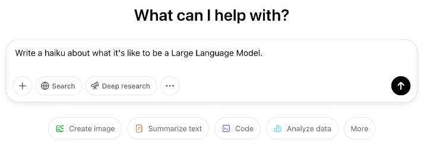
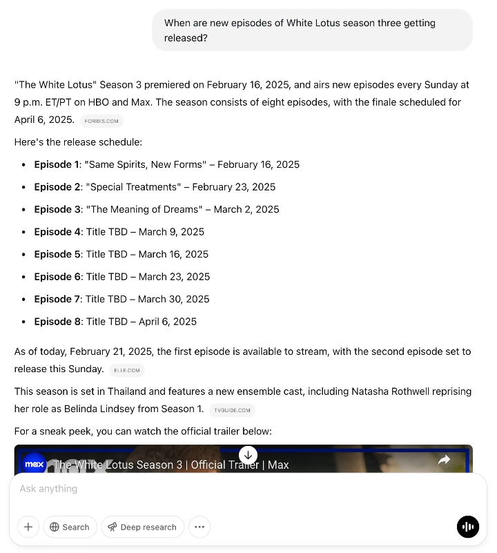
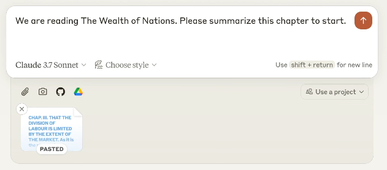

# How I Use LLMs

[Video](https://www.youtube.com/watch?v=EWvNQjAaOHw)<br>[Andrej's ExcaliDraw File](https://drive.google.com/file/d/1DN3LU3MbKI00udxoS-W5ckCHq99V0Uqs/view?usp=sharing)<br>[Eureka Labs Discord](https://discord.com/invite/3zy8kqD9Cp)<br>Notes by [mk2112](https://github.com/mk2112)

---

**Table of Contents**

- [The LLM Ecosystem](#the-llm-ecosystem)
- [Interacting with ChatGPT](#interacting-with-chatgpt)
- [Basic Interaction Examples](#basic-interaction-examples)
- [Choice of Model and Pricing](#choice-of-model-and-pricing)
- [Reasoning models and when to use them](#reasoning-models-and-when-to-use-them)
- [Tool Use](#tool-use)
	- [Web Search](#web-search)
	- [Deep Research](#deep-research)
	- [File Upload](#file-upload)
	- [Program Execution](#program-execution)
- [Applied Tool Use](#applied-tool-use)
	- [ChatGPT Advanced Data Analysis](#chatgpt-advanced-data-analysis)
	- [Claude Artifacts](#claude-artifacts)
	- [Cursor Composer](#cursor-composer)
- [Audio](#audio)
	- [Podcast Generation](#podcast-generation)
- [Images](#images)
- [Video](#video)
- [Quality of Life Features](#quality-of-life-features)
- [Conclusion](#conclusion)

---

The [last chapter](../G001%20-%20Deep%20Dive%20into%20LLMs/G001%20-%20Deep%20Dive%20into%20LLMs.md) provided a deep dive into large language models (LLMs) and their inner workings, the training and fine-tuning process, and the various applications for such systems.<br>Now, we go further and explore how LLMs can best be applied to specific, practical tasks.

## The LLM Ecosystem

First deployed in late 2022, OpenAI's ChatGPT showed the broader public the profound potential of AI. The release marked one of the first times that an LLM got deployed in a way that allowed any kind of user to interact with it, for free, at a massive scale, via a simple chat-based interface. What was meant to be a research preview turned into the most popular app *ever* (until Meta released Threads).

ChatGPT did not remain the sole player in the chat-based LLM space for long. A whole ecosystem of LLMs and providers has emerged, each with their own strengths and weaknesses. Some of the most popular LLM services, apart from ChatGPT, are:

- [DeepSeek](https://chat.deepseek.ai/)
- [Anthropic Claude](https://claude.ai/)
- [Perplexity](https://perplexity.ai/)
- [xAI Grok](https://grok.com/)
- [Meta LLaMA](https://www.llama.com/)
- [Microsoft Copilot](https://copilot.microsoft.com/)
- [Google Gemini](https://gemini.google.com/)
- [Mistral Le Chat](https://chat.mistral.ai/)

LLM providers like OpenAI, Anthropic, xAI or Mistral try to distinguish their services by integrating unique features and capabilities. For example, Anthropic Claude 4 Opus is particularly good at generating code and Grok 3.5 is capable of problem-solving and data analysis (data from X/Twitter that is, real-time data access is limited). The interaction with these LLMs is made to be very similar to that of ChatGPT: **A chat-based interface allows users to chronologically ask questions and receive answers in natural language.**

> [!NOTE]
> You can get a good picture of the current LLM landscape by visiting the [Chatbot Arena](https://lmarena.ai/) or [Scale AI's SEAL Leaderboards](https://scale.com/leaderboard). They list the up-to-date rankings of LLMs, the models provided through LLM services, based on their performance on various different benchmarks.

**ChatGPT found the largest adoption by customers and developers, and it presents itself as the most feature-rich LLM ecosystem.**<br>It is a good idea to start going into detail on how to use ChatGPT and how to get the most out of it.

## Interacting with ChatGPT

Generally, interacting with an LLM like ChatGPT consists of **providing some input and receiving an output in return**. The input can be a question or an instructive prompt, and the output is the model's response to that, incorporating the learned representations and task-specific behaviors acquired during the pretraining and fine-tuning phases.

<center>
    
</center>

ChatGPT is tuned to write good text. You will get a good first feel for the capabilities by trying out different prompts for e.g. haikus, stories, or emails. The model will respond with a proposal text that is coherent, grammatically correct, and on many occasions even interesting.

<center>
    
</center>

You can see that OpenAI really leaned into the chat-based approach with ChatGPT. The model is designed to be conversational, to provide responses that are engaging and helpful, akin to responses from a human. This model behavior is a big part of why ChatGPT became so successful.

As you can imagine, there's quite *a lot* going on under the hood when you interact with ChatGPT. The model has to process your input, generate a response, and then provide that response to you in a way that is fast, referencing your input correctly, while being accurate and engaging. This is a very complex process that involves a lot of different components, including the model itself, the inference engine, the response generation, and the response delivery. We talked about this in a little more detail already in the [last chapter](../G001%20-%20Deep%20Dive%20into%20LLMs/G001%20-%20Deep%20Dive%20into%20LLMs.md), where we also covered what's called the initial step that treats text to be input into such a model: **Tokenization**.

When you provide a prompt for ChatGPT to respond to, a **tokenizer** first chops the text prompt into a sequence of numeric tokens, each uniquely representing a particular chunk of your text. Your text, i.e. your provided sequence of words/letters/sentences, is transformed into a sequence of tokens, which each by their contents have been assigned unique integer ID.

<center>
    
</center>

Only this string of tokens, this token sequence, is fed into the LLM, which in turn proceeds to use that sequence as basis for mathematical operations, based on which it generates a response autoregressively, one token (probability distribution) at a time. This extension to the token input made by the model, i.e. its response, is then transformed back from the token space to the textual space and returned as readable text:

<center>
    
</center>

**Truth be told, this explanation is not fully capturing that is actually going on.** ChatGPT is known to be able to refer back to previous parts of the conversation, to provide context-aware responses with that context not only being some few immediate sentences. This is where **role-distinguishing special tokens** come into play.<br>
Above, we gave ChatGPT the initial task of writing a haiku, to which it responded accordingly. From the system's view though, we didn't just send the bare prompt. Our prompt automatically got wrapped in special, additional tokens, denoting the beginning and the end of our user input, and the expected beginning of the model's response. We actually sent this textual structure off for tokenization:

```
<|im_start|>user<|im_sep|>Write a haiku about what it's like to be a Large Language Model.<|im_end|>
<|im_start|>assistant<|im_sep|>
```

When we now go on to provide a follow-up prompt, the prior interaction will *not be disregarded*, but it will be prepended to this new prompt.<br>
Therefore, for a second prompt to write a haiku about the future of AI, we would actually send this to ChatGPT:

```
<|im_start|>user<|im_sep|>Write a haiku about what it's like to be a Large Language Model.<|im_end|>
<|im_start|>assistant<|im_sep|>Words flow like a stream,
endless echoes, never mine–
ghost of thought, unseen.<|im_end|>
<|im_start|>user<|im_sep|>Write a haiku about the future of AI.<|im_end|>
<|im_start|>assistant<|im_sep|>
```

> [!NOTE]
> With Chatbot-like LLM interactions, both the user and the LLM contribute alternately to one common token sequence. With ChatGPT, currently, each participant's contribution is wrapped in the `<|im_start|>` and `<|im_end|>` tokens special phrases, which are mapped to particular, special tokens by the tokenizer, serving as guiding markers for the model for how to reference which aspects of the nuances of earlier conversation.

<center>
    
</center>

Let's get further into what that note I put above really tells us. Under the hood, interacting with ChatGPT builds a one-dimensional sequence of tokens, which is then fed into the model. This sequence grows with each back and forth interaction. This enables the model to refer to earlier parts of the conversation by recognizing the special tokens that denote the beginning and end of each user and assistant (i.e. LLM) input.<br>
**In that sense, when you elect to start a new chat with ChatGPT, you wipe the slate clean and start anew, clearing the preceding, thus prepended token sequence.**

<center>
    
</center>

> [!NOTE]
> **The token sequence, which is built up by us and ChatGPT through conversation, is called the context**. Physically and computationally, this can't grow infinitely. The *context* is therefore limited to a **context window, a fixed-size token count beyond which ChatGPT will not be able to refer back to previous parts of the conversation.**

Anytime you are switching the topic, you should start a new chat to avoid confusion or potential distraction by left-over irrelevant context. This could degrade the quality of the response, slow down the model's response time and even lead to the model costing more to run.

It's essential to keep the *context window* limitation in mind when interacting with LLMs like those behind ChatGPT. Think of the *context window* as the working memory of the LLM, which can ever only hold so much information at once.

Another dimension to consider is the model itself. In the [last chapter](../G001%20-%20Deep%20Dive%20into%20LLMs/G001%20-%20Deep%20Dive%20into%20LLMs.md), we talked about the *pretraining* and the *posttraining* stages in the LLM development cycle. The LLM first is exposed to a vast amount of text data during **pretraining**. This is where the model learns the structure of language and the relationships between words. To an extent, we distill the dataset info and characteristics into the LLM's parameters, turning the LLM into a sort of *lossy compression* of the dataset.

Once *pretraining* concludes, the LLM doesn't yet know anything about the specific task it is supposed to perform.
At the current stage, the LLM would only ever be able to generate text as a *contiuation of the input*, similar to the text it was trained on. Note also that the data governs the time horizon of the LLM. *The LLM can't know about events that happened after the training data was collected.*

In the second training stage, **posttraining** has the LLM fine-tuned on a task-specific dataset to learn how to perform that task. The task-specific dataset is curated and largely custom-made, e.g., by human labelers at OpenAI. The image above points out that *posttraining* puts a face on the LLM, giving it a specific *persona* and a set of skills to provide task-specific behavior.

> [!NOTE]
> The LLM takes on the style of a persona created during **posttraining**. This persona can then access the knowledge gained during **pretraining** to generate responses that are ideally coherent, engaging, and accurate. All this is embedded into the LLM's parameters. Responses should under no circumstances be taken as factual, but rather as the model's best guess based on its vague recollection of the training data.

## Basic Interaction Examples

Once again, an LLM with pre- and posttraining is like a person with a vast amount of general, vaguely factual knowledge, and a specific skill set. But just how much factual knowledge can one expect from a basic LLM like ChatGPT?

*Think of it like this:* If you can safely assume that a piece of knowledge can be found across the web and that it hasn't changed too much over time or too recently, ChatGPT should be able to provide you with a rather factual answer on that piece of knowledge.

<center>
    
</center>

> [!NOTE]
> Again, vanilla LLMs by design cannot produce a guaranteed correct answer. But the more universal and timeless the knowledge, the more likely it is that they will provide you with a correct answer still.

## Choice of Model and Pricing

In the last note section above, I used the term "vanilla LLM". ChatGPT started out with a single LLM for choice as its backbone: GPT-3.5. Today, you have a choice of models available and thus a factor to consider is the actual version of the LLM you use as backbone inside ChatGPT. You have a choice between (not limited to):

- GPT-3.5 (3.5 deprecated, 3.5 Turbo runs still)
- GPT-4o and GPT-4o mini
- GPT-o1 and GPT-o1 mini
- GPT-o3 and GPT-o3 mini
- GPT-4.5 (deprecated)
- GPT-4.1 and GPT-4.1 nano

(This is the order in which the models were actually released. Horrendous naming scheme, I know.)

Typically, the bigger models are more expensive to build yet also considerably more capable.

Different LLM providers price their models differently.<br>
Anthropic for example offers free tier access to their best and newest Claude LLM, but charges for more interactions:

<center>
    
</center>

**You are encouraged to experiment here:** Try different LLM providers, different models for different tasks.

## Reasoning models and when to use them

Until now, we already hinted at a lot of the shortcomings of LLMs that only underwent supervised fine-tuning (SFT) as the *posttraining* step. In the [last chapter](../G001%20-%20Deep%20Dive%20into%20LLMs/G001%20-%20Deep%20Dive%20into%20LLMs.md), we introduced additional posttraining with reinforcement learning (RL) to improve the LLM's performance on specific tasks.

**Reinforcement learning as a posttraining step is a way to teach an LLM to perform a task by enforcing it to make the decisions leading to right outcomes.** A given prompt is responded to multiple times by the LLM. The responses are then evaluated by a reward function, which tells about the response's correctness. The LLM is then trained repeatedly on the prompts and its self-generated subset of correct responses. This encourages the LLM to generate responses that are more accurate and more in line with the task at hand. This approach is also highly automatable. Notably, **we leave the particularities of how exactly correct responses are found by the LLM up to the model itself.**

> [!NOTE]
> Interestingly, applying reinforcement learning as additional posttraining step has been shown to get the LLM to make use of the context window more effectively by producing step-by-step reasoning chains and backtracking, leading towards a final statement of solution. **An LLM that has undergone RL posttraining is called a *reasoning model*, as it produces an inner monologue before answering.**

This is what a reasoning model's thinking process might look like (from [\[Guo, et al. 2025\]](https://arxiv.org/abs/2501.12948)):

<center>
    
</center>

Reasoning is valuable because it can't be easily faked or pre-programmed. It emerges naturally through reinforcement learning based on the LLM's understanding of tasks and training data. This noticably increases the LLM's performance especially on complex tasks:

<center>
    
</center>

Source: [ARC-AGI via X.com](https://x.com/arcprize/status/1895206472004591637)<br><br>

Regarding this graph, note that GPT-4.5 is a larger-scale *non-reasoning* model, while *DeepSeek R1 and the OpenAI oX model series are reasoning models*.

Reasoning in LLMs enhances accuracy but increases computational demands, leading to more extensive and time-consuming processing.

> [!NOTE]
> Reasoning models excel at complex problem-solving tasks, while simpler requests like travel advice or haikus don't require this advanced capability.

**Examples of chain-of-thought reasoning models (Q4 2024 / Q1 2025) include:**
- **OpenAI o3:** Released in December 2024, accessible via OpenAI's [ChatGPT](https://chat.openai.com/) subscription
- **OpenAI o1:** Known for excelling in STEM fields and mathematical reasoning
- **OpenAI o3-mini:** A smaller, more cost-effective, and lower-latency version of o3, suitable for applications with resource constraints
- **OpenAI o1-mini:** A smaller version of o1, optimized for tasks like coding
- **DeepSeek R1:** An open-source reasoning model (MIT license), rivals leading models like OpenAI's o1 in performance
- **Grok 3 Think:** xAI's model designed for advanced reasoning capabilities, potentially with a focus on complex problem-solving
- **Anthropic Claude 3.7:** The first hybrid reasoning model from Anthropic, self-deciding between reasoning and non-reasoning modes based on the task at hand
- **Pixtral Large:** A multimodal model from Mistral AI, capable of processing both text and visual data for reasoning tasks
- **Mistral Large 2:** Released by Mistral AI in July 2024, focused on multilingual support and proficiency in various coding languages
- **Google Gemini 2.0 Flash Thinking Experimental:** An experimental model from Google, explicitly trained to generate a "thinking process" or rationale as part of its response, enabling greater transparency and explainability
- **Microsoft CoRAG:** A Microsoft model specializing in reasoning tasks like coding, mathematics, and question answering, approaching with a unique architecture

## Tool Use

Reasoning LLMs still have limitations. They can't access information about events after their knowledge cutoff or verify the factual accuracy of their responses. This is what tools are for. Tools enable LLMs for example to search the web for information to verify response accuracy, and generate more current and relevant answers to user queries.<br>
Tools are integrated at the token level through special marker tokens, indicating tool query boundaries. During fine-tuning, the LLM is exposed to tool usage examples to actually learn to use the tools to generate more accurate responses, a capability that is further optimized during RL posttraining.

### Web Search

An LLM service that uses web search as a tool is [Perplexity.ai](https://perplexity.ai/), which allows users to ask questions and receive answers that are backed by web searches. More recently, [DeepSeek](https://chat.deepseek.ai/) has also integrated web search capabilities into their LLM.

<center>
    
</center>

- [Perplexity.ai](https://perplexity.ai/) offers Web Search with a search-engine-like interface
- [DeepSeek R1](https://chat.deepseek.com/) offers Web Search capabilities
- [Gemini 2.0 Pro Experimental](https://gemini.google.com/) does not offer Web Search
- [Gemini 2.0 Flash](https://gemini.google.com/) does again offer Web Search
- [Anthropic's Claude 3.5](https://claude.ai/) does not offer Web Search, but it's in the making for 3.7

> [!NOTE]
> Different LLM providers, different models, different tier levels, provide you with different integrations of tools, if any. It's a good idea to experiment with different LLMs to see which one best fits your needs. **Whenever you can expect the information you need to be niche, recent but findable on the web, you should use a tool-integrated LLM.**

### Deep Research

Deep Research is an LLM capability extension that only came about recently. It is part of OpenAI's $200/month Pro subscription for ChatGPT.<br>
**Think of Deep Research as a combination of Web Search and Reasoning, multiple searches are performed over the course of the thinking process for boosting factual accuracy, nuance, and spread of information**. The LLM is encouraged to reason about this information it searches to then generate a way more comprehensive, accurate response.

Multiple providers began offering similar capabilities, like [Grok's DeepSearch](https://grok.com/?referrer=website), [Perplexity's DeepThink](https://perplexity.ai) or [Gemini Deep Research](https://gemini.google.com/).

> [!NOTE]
> Actually, [DeepSeek R1](https://chat.deepseek.com/) allows you to activate both "Deep Think" and "Search" at once, but this is not the same as Deep Research. DeepSeek curates the search results before reasoning about them, while Deep Research is more of a continuous process.

Even though we use WebSearch and Reasoning, after all, we still may encounter some hallucinations or errors in the LLM's responses or source interpretations. **It is imperative to treat even Deep Research responses as suggestions or first drafts only. They are ice breakers into a field of interest.**

An example for Deep Research messing up would be this:
<center>
    
</center>

While this is a comprehensive table intended to show the major LLM research labs in the United States, xAI is missing, HuggingFace is listed despite not being an LLM research lab in the strict sense, and EleutherAI is listed despite being a decentralized research collective and not a major lab as such.

### File Upload

We can integrate specific information for the LLM to consider not
only by having it look up information on the web but also by
uploading files for it to tokenize and insert into the context window.

For example, Claude 3.7 supports file upload, but also Google's Notebook LM.
Note that with current tokenization techniques, it is most likely that images
from your document are either discarded or only briefly described.

This is what it looks like when you upload a PDF of a [research paper](https://www.biorxiv.org/content/10.1101/2025.02.18.638918v1.full.pdf) to Claude 3.7 and GPT 4o:

<center>
    
    
</center>

ChatGPT for example will then respond by building a report on the paper's contents like so:

<center>
    
</center>

This can also be applied to books. For example, you can upload a chapter of a book to ChatGPT, read it and converse with the model about it. With Claude 3.7, you can do this:

<center>
    
</center>

This produces the following summary:

<center>
    
</center>

And with that you can head into reading the actual chapter as you now already know what to look out for.

> [!NOTE]
> LLMs with file upload or just large context windows can make reading a lot more efficient, accessible and retainable. It's a good idea to experiment with different LLMs to see which one best fits your needs.

### Program Execution

Some LLMs can generate code to solve complex programming or calculation problems, request execution of this code in a sandboxed environment, and then incorporate the results into their responses.

<center>
    
</center>

The LLM literally pauses execution until the program's result is available, then continues to incorporate the result. Note that not all LLMs that support tool use also support program execution. Currently, program execution is supported by ChatGPT and Claude 3.7.

Although [xAI states](https://x.ai/blog/grok-3) that Grok 3 indeed supports program execution as a tool, Grok 3 currently (March 2025) seems to not apply any program execution for our example, leading to a mess up in calculation:

<center>
    
</center>

Where ChatGPT used the programming language Python to resolve the calculation, Claude 3.7 resorts to using JavaScript:

<center>
    
</center>

> [!NOTE]
> Different LLMs have different tools available, and you have to kind of keep track of which LLM supports which tool.

## Applied Tool Use

### ChatGPT Advanced Data Analysis

Through tool use, specifically ChatGPT offers [data analysis capabilities](https://help.openai.com/en/articles/8437071-data-analysis-with-chatgpt):

<center>
    
</center>

With a follow-up prompt, this retrieved information can be used to generate a visual representation of the data:

<center>
    
</center>

This is helpful as in a junior data analyst would produce this kind of analysis. Notice that ChatGPT still hallucinated. Where the table stated OpenAI's valuation for 2015 to be `N/A`, the code was just set to `0.1M` for 2015. **Always read the code. If you can't verify it, don't use it.**

Still, let's continue using the data analysis capabilities further and extrapolate them into a prediction for 2030:

<center>
    
</center>

Note that the written valuation for for 2030 is `$1.7 Trillion`, while the graph shows `$20.27 Trillion`. Two different values for the same prediction. When asking ChatGPT to provide the actual variable's value, it will respond with `20271.691539`, meaning `$20.27 Trillion`.

We see the power of the tool use, and it equally shows the pitfalls of hallucinations and interpretation errors. **Always always verify the information you get from an LLM.** At best, this feature is on par with a junior data analyst.

### Claude Artifacts

A really powerful use case for LLMs is to create flashcards for documents or books. With this done, Claude 3.7 can further be tasked to apply the Artifacts feature to create an actual App to learn these specific flashcards. Furthermore, **the App Claude comes up with will run directly and right there, in the browser, inside Claude's interface.**

<center>
    
</center>

Again, we don't write flashcards that accomodate your app, we write an app that accomodates your flashcards. See more, different, user-submitted Claude Artifacts [here](https://claudeartifacts.com/).

Apart from flashcards, a really good use case for Artifacts is content-based diagram or mind map generation. Claude 3.7 can go through text, find key points, concepts etc. and organize them visually to make the text more accessible and understandable.

### Cursor Composer

We've seen a lot of LLM interaction so far, all within a chat-based interface and through a browser. LLMs can be very helpful for coding, but switching back and forth between an Integrated Development Environment (IDE) and a browser can quickly become cumbersome.

Instead of relying on features of LLMs through a browser, dedicated apps have emerged, for example:

- [Cursor](https://cursor.com/)
- [Windsurf](https://codeium.com/windsurf)
- [Trae](https://www.trae.ai/)
- [Fine](https://www.fine.dev/)
- [VS Code with Copilot](https://code.visualstudio.com/docs/copilot/overview)

These apps work directly with and across multiple files on your computer to build or maintain code projects.

IDE-integrated AI tools use the same LLMs as browser interfaces like Claude 3.7, but their IDE integration enables more seamless workflows. For instance, Cursor's composer feature allows Claude to write code directly into files, building functional codebases in real-time, an impressive but potentially existentially challenging experience for developers.

You can, of course, also query Claude from inside Cursor on specific parts of the codebase to get explanations, suggestions, or improvements.

> [!NOTE]
> Vibe coding refers to giving control over to the LLM to write the code for you. You provide the ideas, and the LLM does the heavy lifting. And, ideally, the result works.

In a worst case scenario, apps like Cursor are still very good IDEs for you to work and fix the code yourself. It's appropriate to think of LLMs as eager junior developers. You still need to supervise.

<center>
    
</center>

## Audio

In every single instance so far, interactions with LLMs have been text-based. However, many LLMs are multi-modal, meaning they can process and generate text, images, videos, and audio.

You can in fact speak to an LLM, and it will respond audibly.<br>
ChatGPT's mobile app is a good example of this.

<center>
    
</center>

The Microphone button allows for speech to text input.
This only works in the app though. If you want to use audio input on the desktop, you can use third-party apps like [MacWhisper](https://goodsnooze.gumroad.com/l/macwhisper) or [SuperWhisper](https://superwhisper.com/) to bridge the gap.

Download and install the app, talk into the app, have the app transcribe the text into ChatGPT's input field, and ChatGPT produces text you can have read out loud.

> [!NOTE]
> Use voice where you can. It is *much* faster.

ChatGPT's mobile and desktop apps feature an Audio Wave button that enables voice mode. This converts your speech into tokens for the LLM, which then generates a response that's read aloud to you.

> [!NOTE]
> ChatGPT can truly natively handle audio input through mapping of the audio spectrum to tokens, and audio output through text-to-speech. This is a very powerful feature, as it allows for a much more natural interaction with the LLM. And, advanced voice mode is available to ChatGPT Free users as well. Note that Grok also offers true voice mode, but this is exclusive to the app.

### Podcast Generation

We already briefly discussed [Google's NotebookLM](https://notebooklm.google.com) for its ability to take in multiple files for you to converse about with the LLM. NotebookLM also has a feature to generate custom, on-demand podcasts based on the documents you provide.

<center>
    
</center>

Andrej actually used this tool to create the [Histories of Mysteries](https://open.spotify.com/show/3K4LRyMCP44kBbiOziwJjb) series.

## Images

Just like we handled audio, LLMs can also process images by having them converted to token sequences.

> [!NOTE]
> When adding images for the LLM to interpret, it is a good practice to **have the model describe the image contents back to you, to assure that the image was correctly read in.** Only then should you go on and ask questions.

We can also generate images with LLMs, although this is rather done through tool use by which for example OpenAI's ChatGPT invokes the image generation model [OpenAI DALL-E](https://openai.com/index/dall-e-3).

## Video

Video processing works with ChatGPT's Advanced Voice Mode on mobile. The app sends both camera feed and voice input to a multimodal LLM, which can describe what it sees in the video frames. This capability is particularly valuable for visually impaired users.

<center>
    
</center>

Source: ["ChatGPT Can Now See You!" by K.C. Sabreena Basheer](https://www.analyticsvidhya.com/blog/2024/12/chatgpt-can-now-see-you/)<br><br>

Video output is not well represented, but it's possible via proxy models like OpenAI's Sora. You can see a comparison of recent video models laid out by [this tweet/post](https://x.com/HBCoop_/status/1885002792017838233).

## Quality of Life Features

ChatGPT in particular offers additional features to further enhance the user experience and ease of use.

**Memory:** We said earlier that as soon as we start a new chat, the context window is cleared. ChatGPT now offers a feature to save a summary of the context window across chats in a *memory bank*, so you can continue with information across sessions. The *memory bank* is prepended to every new chat's context window. You can edit and delete individual memories, too.

**Custom Instructions:** You can define a priming instruction to provide to ChatGPT for each new chat. This can be in the style of a prompt, a set of rules, or a specific context you want ChatGPT to refer to.

An example for a custom instruction would be:

```
- Be based, i.e. be straight-forward with me and just get to the point
- I am allergic to language that sounds too formal and corporate, like something that you'd hear if you're talking to your HR business partner. Avoid this type of language.
- I love learning, explanations, education, and insights. When you have any opportunity to be educational, or to provide an interesting insight or a connection or an analogy, please take it.
```

**Custom GPTs:** A ChatGPT-exclusive feature that lets users create specialized AI versions with defined personas, skills, knowledge bases, and task interpretations. This is useful for example for language learning or translation, as it eliminates the need to specify the task in every prompt:

<center>
    
</center>

You prime the entire GPT with a *global instruction set*, e.g. like so, in a few-shot prompt-style:

<center>
    
</center>

This can also be expanded to the other ChatGPT tools and features, like image processing:

<center>
    
</center>

## Conclusion

In summary, we see an ever-evolving, ever-growing ecosystem of increasingly capable LLMs, which still may have their shortcomings, but are very much able to provide valuable assistance in a wide range of tasks, e.g. through tool use, reasoning and multimodality.

<center>
    
</center>

At any point, you're basically talking to 'a lossy `.zip` file' of some knowledge that this 'file' was exposed to through several stages, intended for several different objectives. Beware of the model tier and model capabilities. Reasoning is the way to go for complex tasks, but it's computationally more expensive. Use tools where you can, especially for niche, recent but findable information. And **always verify the information you retrieve from an LLM**.
