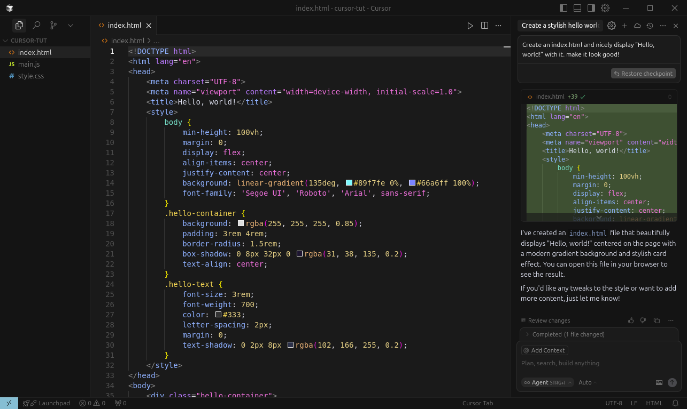

# Software in the era of AI

[YouTube Video - Y Combinator](https://www.youtube.com/watch?v=LCEmiRjPEtQ) [Slides, Keynote - Google Drive](https://drive.google.com/file/d/1a0h1mkwfmV2PlekxDN8isMrDA5evc4wW/view) [Andrej's Bearblog](https://karpathy.bearblog.dev/blog/) Notes by [mk2112](https://github.com/mk2112)

---

**Table of Contents**

- [Changing Paradigms](#changing-paradigms)
	- [Software 2.0](#software-20)
	- [Software 3.0](#software-30)
    - [Emerge, Eat, Expand](#emerge-eat-expand)
- [How to Think About LLMs](#how-to-think-about-llms)
	- [Grids and Plants](#grids-and-plants)
	- [LLMs as Operating Systems](#llms-as-operating-systems)
- [LLM Psychology](#llm-psychology)
- [Opportunities](#opportunities)
	- [Coding Assistants](#coding-assistants)
	- [Web Search](#web-search)
	- [Implications For New Products](#implications-for-new-products)
		- [Self-Driving Cars And The Crux of Integration](#self-driving-cars-and-the-crux-of-integration)
		- [Beyond the Vibe](#beyond-the-vibe)
		- [Build For Agents](#build-for-agents)
- [Conclusion](#conclusion)

---

## Changing Paradigms

>"It used to be that you needed to spend 5-10 years of studying in order to be able to really pull something off in software. **This is not the case anymore.**"

### Software 2.0

Software is changing, again, and fundamentally so. For example, [GitHub](https://github.com) is a place where people all over the world host and work on their code projects. GitHub isn't a tiny, niche tool by any means. By 2024, over five billion developer contributions were made to more than 500 million open source projects on [GitHub](https://github.com). *You could state the obvious: Coding is a quite active, widespread field.*

We've been coding for ~70 years. Think of that as **Software 1.0.**

>[!NOTE]
> The concept of **Software 1.0** refers to pure code. Object-oriented, scripted, you name it. It's the code that programs a computer to do something for us. **Software 2.0** doesn't refer to code anymore, but to the weights that make neural networks attain some capability.

Where [GitHub](https://github.com) served the world of *Software 1.0* there now also exists a platform dedicated to *Software 2.0:* [Huggingface](https://huggingface.co). **What is its purpose?** Neural networks, if built right, can do incredible things. The key intuition behind *Software 2.0* is that you don't directly model instructions/actions for some task anymore. Instead, you have your network's capability *emerge from a training process*, and apply that to the task at hand.

[Huggingface](https://huggingface.co) is a platform where people can share and collaborate on neural networks, especially in the realm of natural language processing (NLP). It is a place where you can find pre-trained models, fine-tune them for your specific needs, and share your own models with the world. It's all about the the weights, the model architectures and the training data.

We've been in the *Software 2.0* realm for some years now, already. Andrej wrote a [blogpost](https://karpathy.medium.com/software-2-0-a64152b37c35) about this back in 2017. Truthfully, neural networks aren't *that* new and they are widely spread across our software landscape already (e.g. recommender systems, classifiers, forecasting systems). **But another update to the software paradigm is emerging now.**

### Software 3.0

The recent update to "What software can be" emerged from Large Language Models (LLMs).
Indeed, *Software 3.0* programs an LLM for some specific purpose or set of tasks. However, this does *not* happen on the level of code or training/weights, but through **prompts.**

**Prompts can temporarily program multi-purpose LLMs to perform specific tasks for us.** The programming language isn't Python or Java or Lisp, but English, French, Spanish, ...

	

### Emerge, Eat, Expand

Curiously, it seems that **each paradigm update continually eats up space formerly occupied by the prior paradigm versions.**
Equally, **newer paradigm versions also open up newly addressable problem spaces.**

Robotic systems like Tesla's Autopilot are a great example for this. 
The more capable the neural networks became as part of the software stack, the more space they occupied and the more tasks they would take over from what was previously hard-coded C++. Specifically, such a transition took place for the sensor fusion, e.g., merging images from the multiple camera streams.

	

It is exactly these kinds of "expansionist properties" that can be observed for *Software 3.0* all over again:

	

>[!NOTE]
> 3.0 doesn't outright replace 2.0, which itself doesn't outright replace 1.0. Rather, every paradigm has its pros and cons. **When working with software, one should be fluent in all three paradigms.**

## How to Think About LLMs

We said that code programs computers, weights program neural networks, and prompts now temporarily program the special, multi-purpose neural network type that is the LLM. 
By analogy, LLMs are the new computers. So what really are LLMs and what ecosystem do they reside in?

### Grids and Plants

The ecosystem looks like an electrical grid, where different providers offer LLMs:
- **Capital Expenditures** by companies like [Anthropic](https://www.anthropic.com/), [Google DeepMind](https://deepmind.google/) and [OpenAI](https://openai.com/) are used for training massive, multi-capable LLMs ('building the power station')
- **Operational Expenses** go into systems to provide access to these LLMs to wider user bases ('building the grid')
- **Access** is then provided on a metered basis ('pay $x / Million Tokens of LLM output')
    - If you don't know what tokens are, read about them in [T001 - State of GPT](../T001%20-%20State%20of%20GPT/T001%20-%20State_of_GPT%20-%20Notes.md)
- **Demands** may be high uptime, low latency, or high throughput (akin to voltage, current and power demands)
- **Switching** between LLMs is quick and easy, e.g. by using [OpenRouter](https://openrouter.ai/) (a bit like solar panels vs. wind turbines)
- **Disturbances** can be caused e.g. when a provider's LLM is down (akin to a power outage)

**But it's more than that. The ecosystem surrounding LLMs can, at several points, resemble fabrication plants, especially recently.**

LLM providers like [OpenAI](https://openai.com/) or [Google DeepMind](https://deepmind.google/) allocate huge amounts of capital to build LLMs, which become the ecosystem's center. Some of these companies then also build and expand their own research and development departments on top of that. Google (TPU) and Intel (Gaudi) are furthermore building their own chips/hardware. Think of anyone training on NVIDIA GPUs as "renting office space" in that sense.

### LLMs as Operating Systems

These are loose analogies. They aren't perfect. **However, comparing the LLM ecosystem to (traditional) operating systems yields a really good fit.**

**LLMs are highly complex things to build.** They are trivial to copy and paste once they are built, and they are relatively easy to interact with. Open Source LLMs are freely available, communities gather around them. Switching between models may come with distinct up- and downsides. **All this sounds like what we know from operating systems, doesn't it?**

	

The operating systems analogy is further sharpened by the fact that **LLMs have been enabled to use tools** (calculators, python interpreters, web search, etc.) and even other LLMs to perform tasks. Additionally, **LLMs are increasingly multi-modal**: They can interpret text, images, video and audio for peripheral tasks. 

- **What once was Random Access Memory (RAM) is now an LLM's context window.**
- **What once was a hard drive is now an LLM's knowledge base, attained from all the training and fine-tuning.**

The way LLMs are provided and used is similar to how computers were utilized in the 1960s and 70s: You had a centralized mainframe with equally centralized resources, everybody who wanted to could get a share of the mainframe's compute resources. **Equivalently, we now time-share LLMs like those 60's mainframes.** 
Moreover, we chat with LLMs in a terminal-like manner.

Distributed, on-device ML in this context really feels like a logical next step for the LLM ecosystem.  Tools like [Ollama](https://ollama.com/) and [exolabs](https://github.com/exo-explore/exo) really push the field in terms of making things local, friendly and yet speedy. Making LLMs and ML in general more efficient is a [buzzing](https://efficientml.ai) topic right now.

A striking dissimilarity to operating systems is that LLMs emerged from the reaction of a broad consumer base to it. [It didn't really trickle down from usage in governments or big corporations, but rather went up the ladder.](https://karpathy.bearblog.dev/power-to-the-people/) That's unlike the internet (ARPANet) or computers or thus operating systems. The research preview that was [ChatGPT](https://chatgpt.com), through the response it got was the catalyst for the LLM ecosystem to emerge.

## LLM Psychology

**LLMs are approximative autoregressive people simulators in (at least) the text plane.** This is because LLMs are trained mainly on text data, often enough written by people, aiming to emulate producing such text. And in some aspects, this shows: **LLMs can really easily pick up on distinct writing styles,** for example. They are very good at retrieving patterns from the data they encountered during training.

The 'people simulators' analogy is weakened, though, as soon as we face **LLM hallucinations**. 
Current LLMs, according to benchmark results, provide PhD-level answers to certain questions, but at the same time may fail on elementary school math problems. 
A lot of this can actually be traced back to the context window and its finite size. It reveals a striking distinction from how humans work and it's a limitation that can be exploited, which can make LLMs behave in unsafe, very distinctly non-human ways.

>[!NOTE]
>The landscape of outputs that an LLM may produce has some great peaks, but also some surprising and deep valleys.

## Opportunities

### Coding Assistants

If you are in the field of coding, you probably have heard of the term "Coding Assistant" by now. 
LLMs can help you write code. Tools include:

- [GitHub Copilot](https://github.com/copilot)
- [Cursor](https://cursor.so/)
- [Windsurf](https://windsurf.com/)

This is a juicy emerging market. Expectations are high. This can be seen with the recent attempted (but failed) acquisition of Windsurf by OpenAI for $3 billion. **Here's what [Windsurf](https://windsurf.com/) looks like:**

	
	Source: <a href="https://windsurf.com/" target="_blank">windsurf.com</a>

  

Andrej showed Cursor, a competitor to Windsurf, in his talk. It has a similar interface, and is also quite popular in the AI community. Some startups now even outright announce their products as "Cursor for XYZ", catering mainly to their own bubble (for better or worse). **Here's what [Cursor](https://cursor.so/) looks like:**

	

The editable code view is on the left, the chat window is on the right. 
As a programmer, you can just write code the traditional way, but with the LLM chat window, you can now also ask questions about the code project you have opened, get explanations and even have the LLM write or change code and use tools, like the file system operations or terminal commands, to help with that. 
AI-enhanced IDEs like Cursor and Windsurf orchestrate a ton of wiring behind the scenes, be it the embedding of files, the interaction with remote LLMs, the integration of generated code into the codebase at the right place, the unified interface for interaction with different LLMs, and so on. **This is a lot of work, and it is all lifted off of the user automatically.**

You, the user, simply provide the LLM with an idea of what to do, and it (*ideally*) goes on to realize or contribute to that idea, within the confines of your coding project. We know LLMs are fallible. Therefore, you always are reserved the final 'Accept/Decline', and you can always edit (and should always at least read, understand and test) the code that the LLM generates.

### Web Search

When ChatGPT came out, people were quick to realize that it could be used for responding to personalized questions and search queries. Crucially, you wouldn't have to necessarily convey distinct keywords, but meaning to an LLM for it to provide output addressing your question. **However, LLMs on their own are autoregressive next token samplers and, in a vanilla setup, are not incentivized to provide you with the most up-to-date information, but with information that looks and feels appropriate. Tool-use addresses this mismatch in actual and perceived objectives**, as it allows LLMs to access the web and retrieve, review, check and validate recent information.

[Perplexity](https://www.perplexity.ai/) offers a search engine providing you with answers researched by an LLM. This approach was quickly also integrated into ChatGPT and other competitors, like [Claude](https://claude.ai/).

	

### Implications For New Products

When building new tools and products in the software space, right now, you already have to ask yourself:
- `"Is this a product that can be integrated with an LLM?"`
- `"Can I ease usability further through some sort of autonomous agent?"`
- `"What should such a system be able to see and do, and where should the human be in control still?"`

The integration of requirements by LLMs helps sustain a high-quality generation-verification loop. AI generates, humans verify. 
**A product's value, if it can integrate LLMs mindfully, is then to a non-negligible degree determined by how fast this loop can be executed.** 
The faster, without loss of quality, the better.

**How can we go faster then?**

- Get the GUI right, make verification easy, thorough and fun
- Increase the probability of LLMs to generate correct outputs

We can see the downsides of the current state of this loop with a trend called "vibe coding." 
This happens when a developer uses an LLM to generate code, but then doesn't really check it, just "vibes" through the implementation, outsourcing as much work as possible until at least a minimum viable solution is generated. 
This sounds fun an big names like [Rick Rubin](https://www.thewayofcode.com/) encourage trying it out. Nothing speaks against trying out "vibe coding". It's a great indicator showing how capable the applied LLMs are. But other than with music, this practice can lead to bugs and security issues, as the vibed code may not be thoroughly vetted or may rely on outdated dependencies, etc. **Vibe coding, in its current form, is like releasing your project/idea into uncanny valley and hoping it will make it out just fine. At the same time, it is really fun and can function as a gateway drug to genuine software engineering, if the vibe-coder isn't lazy.**

**Vibe coding shouldn't be disregarded. It is a trend, but is also an early indication of where things are headed.** 
And truth be told, having some work lifted off your shoulders is a great thing.

**How can we go faster by using LLMs without breaking into vibing out code?**

- Describe the single, next concrete, incremental change
- Don't ask for code, ask for approaches
    - You pick an approach, draft code from there
    - Review and learn, **actively** pull up docs, API references, etc.
    - Question the choices in the draft code
    - Backtrack, if necessary
- Use versioning tools like Git to afford yourself the ability to freely test things out, roll back, and try again
- Ask for suggestions on what to implement next
- Repeat.

See also [this great blog post](https://blog.nilenso.com/blog/2025/05/29/ai-assisted-coding/) on the topic.

#### Self-Driving Cars And The Crux of Integration

We briefly talked about Tesla's Autopilot already. Self-driving cars are a great example of how AI and logic adapted from LLMs can be used to make sense of the world around us. Actually, the integration of Autopilot into Tesla's software stack is a great example of how AI can be embedded into a system while also being presented nicely to a user via a GUI.

Self-driving cars are worked on for a long time now. Driving is tricky, so the software to automate it all is tricky to attain. 
**We should tread carefully with how we apply LLMs and, unlike with vibe coding, apply some seriousness to how we integrate everything. That increases the value of the LLM's application.**

	

#### Beyond the Vibe

We already discussed vibe coding and found it a fun way to get started with actual software engineering, but it is certainly a stepping stone, not a final goal. 
And, actually, **the entire "allure of vibing" finds a comically abrupt halt once your code starts interfacing with the real world**, e.g., with payment processors. 
Andrej reported that his app [Menugen](https://menugen.app/) took a couple hours to build, and then *a week* to actually get to work in the real world, with integrated payments, etc.

This will foreseeably remain a common bottleneck to AI-accelerated software development. Augmentation, not replacement. Checking and validating is key.

#### Build For Agents

Agents emerge as human like entities interacting with the world from the point of view of a user. 
Make your product easy for them to interact with. 
This can mean polishing your website's `robots.txt`, or writing a documentation in Markdown, which is easily readable by LLMs.

**Make your software's docs structurally legible to LLMs.**

First helpers in this area emerge. For example, for GitHub, tools like [GitIngest](https://gitingest.com/) or [DeepWiki](https://deepwiki.org/) can help make GitHub repositories more accessible for being read by LLMs.

One can expect future agentic systems to become able to point and click, to drag and drop, and to require these added measures we just talked about less and less. 
**But for now, we should put in the effort of making things LLM-accessible to minimize friction and maximize the value of our products even in automated environments.**

## Conclusion

Contrary to some doomer beliefs, **right now is an AMAZING time to get into software.** 
**Things are changing, fast and fundamentally so.** 
LLMs start to play their role as part of increasingly capable ecosystems, aiding us in our way of working, e.g., with software. 
Vibe coding is an on-ramp to this new world. **Avoid getting stuck on the on-ramp.** 
Cycle through generation, comprehension and validation, carefully, and build also with LLM agents using your products in mind.

**Software 3.0 is here. Embrace, learn and advance with it.**
